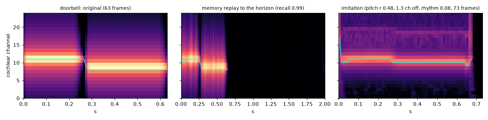
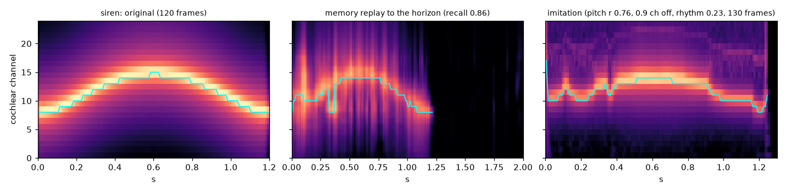
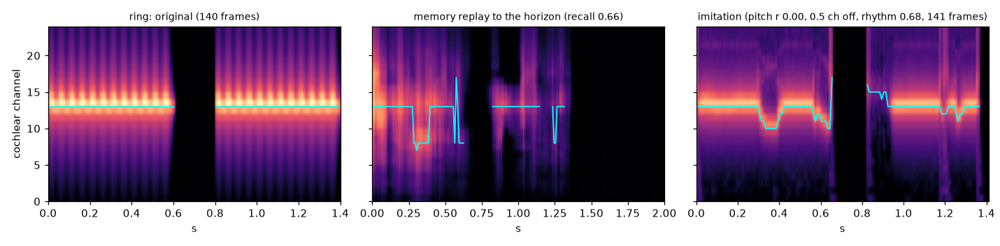

# 10 · Grey parrots: hear, remember, imitate

Two African greys live in a household. Six sounds happen there: a doorbell, a phone, a
microwave, a whistle, a siren, and someone saying hello. Three of them happen well over a
hundred times a day, three a handful of times. Each parrot has a cochlea, a syrinx with
three muscles, and one equilibrium net for a brain. By the end of the day it sings the
doorbell's two notes, the whistle's arch and the phone's two bursts back, in its own voice.

**Play with them:** the page shows both birds and both brains settling live. Play the
household to them, record a noise of your own or draw a whistle and repeat it until a parrot
picks it up, let one speak and watch the other listen and learn from it. Every settlement
and every learning update in the page is the same rule as in training; the brain view shows
every owner's activation and, after each update, the seams that moved. The "Hear the
receipts" panel plays the exact muscle commands the receipts scored, next to the originals.

```bash
python train.py                     # two simulated hours (about half an hour of wall-clock); writes receipt.json, net.json, bouts.json, imitations/*.wav
python train.py --seed 1 --tag _1   # the second parrot: receipt_1.json, net_1.json, ...
python train.py --verify receipt.json
python build_page.py                # embeds both nets and the cochlea's filters into index.html, and the receipt's numbers into this README
```

## The biology, and where we took shortcuts

| in the bird | here | shortcut |
|---|---|---|
| cochlea and auditory nerve: a tonotopic map of the sound's envelope | 24 band-pass filters on a log scale from 200 Hz to 5 kHz, an RMS envelope per 10 ms, log-compressed to levels in [0, 1] | linear filters, no adaptation, no phase |
| lateral inhibition along the auditory pathway, pitch-tuned and intensity-tuned neurons | a frame's peaks (channels within 70% of its loudest), its dominant channel as a bump over the channels, and its loudness as a bump over six owners | computed on the way in, not by owners of the net |
| the sequence code of HVC: each projection neuron bursts once, at one moment of one vocalisation, so the population is a clock keyed to what is being sung | 768 *sequence owners*, each a fixed random conjunction of the sound's *cue* (its first 160 ms after lateral inhibition, held while it lasts) and a *clock* (a bump that moves along 50 owners over 2 s from the onset); the 24 that read the conjunction most strongly fire, graded | the chain is wired at birth (random conjunctions with winner-take-all) rather than grown by learning |
| auditory memory of familiar sounds (caudomedial nidopallium), which forms by repeated exposure and fades without it | one-way seams from the sequence owners to 24 *expected-frame* owners, nudged toward the cochlear frame heard at each tick, the quiet after the sound included; every memory update decays these seams a little, so what repeats stays and what does not fades | the memory is a lookup from (sound, moment) to a frame; the seams from HVC to RA are indeed one way |
| the song system's mirror neurons: cells that fire both when the bird produces a sound and when it hears it, the inverse model from a heard sound onto the command that makes it | the same net's *vocal population* (96 owners) between the mirror's view of the last 40 ms and 16 motor owners, nudged, while the parrot hears its own babbling, toward the command it issued one frame earlier | one frame of delay between command and sound |
| the anterior forebrain pathway (LMAN): the source of vocal variability, and of the drive to practise when the bird is alone | an arousal integrator that fills in quiet and opens a bout; three bouts in four babble: smooth random muscle commands with a new pitch and tract setting every 600 ms, 80 to 200 frames a bout, about 230 bouts and 34,000 frames a day | a scalar arousal, a coin for babble against imitate |
| dopamine from the ventral tegmental area, signalling whether a rendition came out better or worse than usual | built (noisy commands while imitating, the command taken pulled toward by its advantage against a running mean of the mismatch with the memory's expectation) and switched off: measured over a day it made the mirror worse, see below | the critic is the memory's own expectation; a scalar running average is the baseline, and that is the flaw |
| the syrinx: two labia in an airflow, tension setting pitch, air-sac pressure switching phonation on | the Amador–Mindlin labial oscillator `x'' = -eps x - C x² x' + beta x'`: tension sets `eps` (pitch 300 Hz to 3.5 kHz), pressure sets `beta`, and phonation starts through a Hopf bifurcation at pressure level 0.3. The sound is the airflow the labia gate: they close once a cycle and cut the flow, so the source is a pulse train (its rate of change, as sound radiates) with harmonics, plus turbulence noise in proportion to the pressure | one sound source, not two |
| the vocal tract, beak and tongue (parrots shape formants with the tongue) | two resonances: the trachea's, fixed at 1.5 kHz, and one a third muscle sets between 800 Hz and 4 kHz; the radiated sound is soft-limited | two resonances |
| the syringeal muscles, fast but not instant | each command is taken on at half its difference per 10 ms frame | one time constant for all three |
| what the bird attends to | a sound that begins after 200 ms of quiet starts the clock; its first 160 ms are its cue; the cue is kept for replay once the sound has been over for 300 ms (up to 24 kept); a replay draws among cues in proportion to how well the memory recalls them | the cue is a snapshot, not a memory of its own |

Names never reach the brain. The receipt's per-sound scores use them only to look up which
sound was which.

## How it learns, exactly

One net, two populations that share nothing but the rule. The memory side: 768 sequence
owners, one-way seams to 24 expected-frame owners. The mirror side: 216 input owners (the
peaks, the pitch bump and the loudness bump of each of the last four frames), 96 vocal
owners, 16 motor owners; tied seams between neighbouring layers. Each population moves and
decays only on its own updates (`Learner.trainable_overlaps` and `trainable_owners`) and
keeps its own momentum. Three learning signals, all the free/nudged rule with the
quadratic nudge on one output group:

1. **Listening.** When a household sound begins after a quiet spell, the clock starts and
   the parrot buffers what it hears; 160 ms in, the cue exists, and from then on each 80 ms
   chunk gives eight rows: the sequence owners awake at (cue, tick), and the frame heard at
   that tick. Settle free; settle with the expected-frame group pulled toward the frame
   (`beta · (frame − s)`), settle with it pushed away; move each seam from an awake sequence
   owner by the difference of the two Hebbian products, at rate 5, and decay every memory
   seam by 0.01%. The clock runs for 2 s, so the quiet after the sound is learned as part
   of it. The expected-frame owners learn no bias: a moment the memory never learned must
   sound like nothing, not like the average sound. The memory is switched off while the
   parrot sings, as auditory responses in the song system are.
2. **Babbling.** During a babbling bout, each frame the parrot hears (its own voice, one
   frame after the command) gives a row: the mirror's view of the last 40 ms, and the
   command that produced it as a bump over the motor owners. The same update, on the motor
   group, at rate 0.3 with momentum 0.9. Every bout ends with eight frames of a closed air
   sac, so quiet maps to closed. The mirror never learns from imitation bouts: their
   commands are its own answers, and a mirror taught its own answers settles on one command
   for everything (measured: it did). It wants a lot of babble: with 15,000 babbled frames
   a day the imitations sit 2.4 channels from the original's pitch, with 34,000 they sit
   1.5.
3. **Getting better, switched off.** `REFINE` puts smooth exploratory noise on the commands
   of an imitation bout and, for each frame, nudges the command taken toward or away by how
   much better or worse than the running average the heard frame matched the memory's
   expectation (the reward rung's rule with the parrot's own memory as the critic). Measured
   over a day it makes the mirror worse (pitch distance 2.3 channels with the whole frame as
   the critic's measure, 2.0 comparing the loudest channels, 2.4 with no reinforcement and
   the same babble): a sound the parrot already sings well gets a positive advantage on
   every frame, so the mapping is pulled toward the noise. The next critic needs a baseline
   per moment, not one running mean.

To say something, the parrot takes a cue and runs the clock from zero: the memory answers
tick by tick with the frame it expects, nothing it says is fed back, so a replay cannot
drift. The replay ends a few frames into the first 250 ms in which the memory expects less
than 30% of the loudest level it has replayed so far (longer than any gap inside a
household sound; the phone's is 200 ms). Each expected frame is sharpened and shown to the
mirror as the latest of the last 40 ms; the mirror answers with a command; the muscles take
it on over a frame or two; the syrinx sounds. The template drives, as the bird's memory of
the tutor drives its song; what the parrot hears of itself goes to the critic.

## What the receipt measures

- **recall**: the memory alone, run from a sound's cue with the clock started from zero,
  correlated with the sound's cochleagram. A sound the memory holds replays; one it does not
  does not.
- **imitation**: the loop through the body from the same cue, the produced sound heard through
  the cochlea and correlated with the original (whole cochleagram); its **spectral shape**
  (each frame's mean level removed, so a loud broadband voice scores nothing for loudness
  alone); its **pitch track** (the correlation of the dominant channel where both are loud,
  zero where the original holds one pitch) and the **pitch distance** (mean distance of the
  dominant channels, in channels of a seventh of an octave); its **rhythm** (correlation of
  the loudness envelopes).
- all of it for the sounds heard often, the sounds heard rarely, and an untrained brain;
  two days per parrot, the second with the frequent and rare roles swapped, so every sound
  is scored both ways.

<!-- results -->
Two 60-minute days, the second with the roles swapped so every sound is scored once heard often and once heard rarely (day A: 439 household sounds, 284 spontaneous bouts, 230 babbles and 54 imitations; 387 s of wall-clock a day). The first parrot, seed 0:

| sound | heard often / rarely | recall, heard often | recall, heard rarely | recall, untrained | imitation, heard often | imitation, heard rarely | imitation, untrained | pitch track, heard often | pitch distance (channels), heard often | rhythm, heard often |
|---|---|---|---|---|---|---|---|---|---|---|
| beeps | 153 / 6 | 0.978 | 0.819 | 0.091 | 0.634 | 0.403 | 0.070 | 0.000 | 1.08 | 0.489 |
| doorbell | 129 / 7 | 0.989 | 0.838 | 0.031 | 0.624 | 0.675 | -0.055 | 0.480 | 1.29 | 0.082 |
| hello | 137 / 8 | 0.979 | 0.864 | 0.022 | 0.429 | 0.483 | 0.008 | 0.615 | 3.72 | 0.190 |
| ring | 150 / 4 | 0.988 | 0.664 | 0.025 | 0.898 | 0.816 | -0.012 | 0.000 | 0.05 | 0.815 |
| siren | 139 / 9 | 0.987 | 0.857 | 0.027 | 0.818 | 0.778 | 0.033 | 0.897 | 0.79 | 0.238 |
| whistle | 141 / 7 | 0.994 | 0.735 | 0.055 | 0.750 | 0.656 | 0.157 | 0.861 | 1.75 | 0.601 |

Means: recall 0.986 when a sound was heard often against 0.796 when it was rare and 0.042 untrained; 6 of 6 sounds are recalled better after the day that repeated them. Imitation (whole cochleagram) 0.692 / 0.635 / 0.034; spectral shape 0.743 / 0.707 / 0.138; pitch track 0.476 / 0.419 / -0.125; pitch distance 1.45 / 1.74 / 8.03 channels; rhythm 0.403 / 0.300 / 0.023. Brain: 1120 owners, 19,552 parameters. The second parrot (seed 1, its own receipt) recalls 0.982 / 0.827 and imitates at 0.658 / 0.619 against 0.205 untrained, with a pitch distance of 2.00 channels. The receipts bind these numbers to the code and the seeds.
<!-- /results -->

## What it looks like

`python bench.py` draws, for each sound, the original, the memory's replay to the horizon of its
2 s clock, and the imitation as cochleagrams (24 channels, low to high) with the pitch track
in cyan; these are Coco's after day A, on which the doorbell was heard 129 times and the ring
4 and the siren 9.



*The doorbell, heard 129 times: the memory replays both notes and the quiet after them; the
imitation steps from the first note to the second at the right moment.*



*The siren, heard 9 times: the memory holds the slow sweep and the imitation follows it (pitch
track 0.76 for this parrot on this day).*



*The phone, heard 4 times: two bursts with the gap between them; the mirror closes the air sac
for the gap.*

## What we learned building it

The first version of this rung (kept in the history) held the memory as a next-frame
expectation over a context window and fed its own expectations back as the next context.
It recalled 0.6 and its imitations were a constant buzz: the replay drifted into a blur
within a few frames, and the mirror never tracked pitch. Everything below came out of
comparing the replays and the imitations with the originals, spectrogram by spectrogram.

- **A memory that feeds itself blurs; a clock does not.** Replaying on one's own
  expectations compounds every error, and after a few frames the context resembles nothing
  the net learned, so it answers with the mean. A cue held for the sound's duration and a
  clock started at its onset make the memory a lookup from (sound, moment) to a frame, and
  the replay is as crisp as the learning was. This is also what HVC does.
- **A conjunctive code has to be conjunctive.** Random projections of cue and clock added
  together and thresholded gave owners that answered to the cue alone or the clock alone,
  so two moments of one sound, or two sounds at one moment, shared most of their owners.
  Multiplying the two projections before the winner-take-all (a coincidence detector) made
  the overlap the product of the two overlaps, and rare sounds stopped being overwritten by
  frequent ones (whistle after eight hearings: 0.36 to 0.82).
- **A tied seam back into an input layer is a leak.** With seams both ways between the
  chain and the expected frame, the feedback woke "silent" sequence owners to 0.04 on
  average and 0.38 at most, so every sound's update moved every other sound's seams at a
  quarter of the rate of its own. One-way seams, as from HVC to RA, made silent owners
  exactly silent.
- **Momentum only slows a sparse code.** A seam from a sequence owner is touched once per
  hearing of its sound; its running average has decayed to nothing in between, so momentum
  0.9 simply scaled the step by 0.1. Plain steps at rate 5 recall 0.99 for frequent sounds
  and 0.94 for rare ones after a day; rate 0.3 with momentum, 0.94 and 0.70. The mirror,
  whose inputs are dense, keeps momentum; the two populations keep separate running
  averages, or a memory update damps the mirror's and the reverse.
- **No bias on the expected frame, and learn the silence.** With a learned bias, a moment
  the memory had never seen replayed as the average sound; with seams only, it replays as
  nothing. And the clock has to keep running after the sound: with only 300 ms of quiet
  learned, the ticks after that answered with the other sounds that share owners, and the
  parrot sang on after the doorbell.
- **The mirror reads at test what it saw in training.** Trained on its own voice's raw and
  sharpened frames and tested on sharpened expectations, it answered every pitch with 900
  Hz. It now reads the peaks, the dominant channel as a bump, and the loudness as a bump,
  which read the same for a lone sharp peak in a replay and for the cochlea's broader one;
  the loudness bump also gives silence a pattern of its own, so quiet can mean a closed air
  sac (the bias alone said 0.6, open). A bump readout that averages over the whole group
  drifts to the middle whenever the pattern is not a clean bump, so the ends of the pitch
  range were unreachable (0.9 read as 0.7); reading the centroid around the peak fixed it.
  The high notes also need the low seam decay: at 3e-4 per update the mirror topped out at
  1.9 kHz, at 1e-4 it reaches 2.6.
- **The body decides whether the pitch can be heard.** With the labia's resting gap at
  6e-3 they were shut most of each cycle, and the harmonics near the tract's resonances
  outweighed the fundamental: the parrot's own voice was a buzz whose loudest cochlear
  channel was not its pitch, so the mirror could not learn one from the other. At 0.015
  the fundamental is the loudest channel at every tension and pressure, and the imitations'
  pitch distance fell from 2.5 channels to 1.5. A muscle that takes on half a new command
  per frame removes the cracks a single wrong frame from the mirror would make.
- **The dopamine rung needs a better critic.** A scalar running mean is not a baseline: a
  sound the parrot already sings well scores an advantage on every noisy frame, and the
  mirror drifts toward the noise. Off for now; the babbling does the teaching.
- **A syrinx is quiet on a low note.** The radiated sound is the flow's rate of change, so a
  660 Hz note comes out at a third of a 2 kHz note's level, and the doorbell imitation is
  18 dB below the original. The `imitations/*.wav` files keep the physics; the page plays
  the parrots' voices through a ×3 amplifier.
- **Look at the spectrograms.** The plain cochleagram correlation rewards being loud in the
  right places; the pitch-track correlation is zero for any sound of one pitch. The pitch
  distance and the rhythm, and the three-panel plots (original, memory replay to the
  horizon, imitation) that the bench draws, are what told the memory's blur from the
  mirror's compression from the body's buzz.
