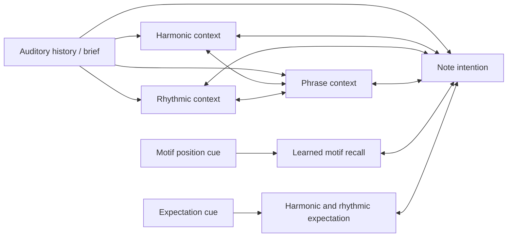

# The composing brain

Every neuron holds a potential, publishes a bounded activation and reads incoming
messages. Local updates repair the difference between its potential and its
synaptic input plus external drive and bias. The named regions below belong to one graph.
A phrase is emitted only after comparing isolated candidate trajectories.

| Component | Neurons | Role | Where its information comes from |
| --- | ---: | --- | --- |
| Auditory history and brief | 636 | Four prior note events, pitch-class history, beat/phrase position, mode, style and arousal | Supplied event encoder; learned outgoing synapses |
| Harmonic context | H | Recurrent latent context coupled to phrase and note intention | MIDI-trained weights; functional label expresses design intent, not proven exclusive specialization |
| Rhythmic context | H/2 | Timing context coupled to phrase and note intention | MIDI-trained weights |
| Phrase context | H/2 | Integrates history, motif features and the other latent populations | MIDI-trained weights; not by itself a proven long-term memory module |
| Note intention | 147 | Melody 61, duration 12, chord 25, bass 49 | Joint settled state, read as four probability distributions |
| Motif position cue | 6 | Addresses positions in the committed opening motif | Supplied readback schedule |
| Motif recall | 61 | Recalls the learned pitch at a cued motif position | 366 fast delta-rule synapses, plus reciprocal links to note intention |
| Expectation cue | 192 | Previous chord by mode; previous duration by arousal and beat | Supplied context readback |
| Harmonic and rhythmic expectation | 36 | Expected next chord (24) and onset duration (12) | 2,880 synapses from smoothed corpus transition tables, linked both ways to note intention |

The pretrained sizes H=96, 256 and 768 contain 975, 1,295 and 2,319 neurons.
The performing brain adds 67 motif neurons and 488 directed synapses: 366 memory
synapses and 61 links in each direction between recall and note intention. It adds
228 expectation neurons with 2,880 expectation synapses and 36 links in each direction
between expectation and note intention. Counts,
checkpoint hashes and per-region lesions are recorded with every assessment.
The additional motif synapses learn only after a real phrase is selected; an
imagined candidate cannot write itself into memory.

All arrows are actual synapses of one Cadence brain. Reciprocal traffic lets
note intention and its contexts affect one another. `MotifBrain` uses the public
`assemble` pattern and `FastSynapses` delta updates; it introduces no new neuron model.

## From a brief to a minute

The brief selects bounded style/mood controls. A supplied tonal plan and four-bar
phrase structure establish a scaffold. In each phrase, six candidate continuations
run in separate batch rows, using the same learned weights and independent
sampled choices. Each row carries its own settled state into the next imagined
note. Alternative futures never share that transient state. Controlled detuning adds bounded Gaussian drive to latent
neurons. A supplied explicit critic compares scale fit, strong-beat harmony,
melodic leaps, repetition, variety and motif return. The selected continuation
is committed to the score; candidates and scores remain inspectable.

The first six committed melody pitches write the motif synapses. Later cue inputs
activate their recall population, which influences note intention through actual
synapses in the joint graph. A running list also retains the score for editing;
that score storage is an application record, not a hidden claim of neural memory.

Each phrase is a future simulation: the candidates roll forward through the brain's
own predictions, the critic compares where they lead, and imagined candidates never
write memory. The selected quality minus its running expectation passes through `Valence`.
Better-than-expected quality narrows exploration; a shortfall broadens it.
The baseline resets at the start of each composition and is recorded per phrase.

A user preference supplies a signed valence to the relationship memory. The chord,
rhythm and interval associations touched by the piece move toward or away from what
it contained. Exact notes never enter this memory, and the trained event synapses stay
unchanged. A held-out check rejects an update that raises relationship loss by more
than 1% and restores the previous tables. Accepted tables are saved to
`checkpoints/personal/music.npz`; `serve.py --taste` loads them.

The draft is synthesized with GeneralUser GS. The actual waveform is measured
for silence, clipping, dynamics, onset flux and pitch-class energy. The weakest
phrase is re-imagined with twice as many alternatives; replacement requires an
improvement in the **whole-piece** explicit score, followed by an audio-health
check. Other phrases remain intact. Accompaniment and orchestration are currently
supplied arrangements, not learned multi-instrument performance.

## Equilibrium, oscillation and work

Training uses bounded free/nudged phases. During composition, `settle_checked`
continues the same neuron model in chunks, with more early samples for a displayed
rehearsal, until the maximum neuron-equation
error is at most 1e-5, or a 512-step budget is reached. Both outcomes are recorded.
A cap is never relabeled as convergence. More numerical disagreement can consume
more repairs, but no equivalence between musical difficulty and step count is
assumed. A small residual is a local equation check, not a theorem of uniqueness,
stability, musical quality or global optimality.

The viewer measures every neuron for signed population means and RMS mismatch.
All 2,614 performing neurons and 1,702,938 directed synapses are mapped, using a
binary full-graph export and WebGL2. No neurons or synapses are dropped to create a
representative diagram. Zoom resolves densely drawn synapses. Region colors identify
connectome roles; separate channels show activation, equation error, state change
and actual synapse plasticity. Every fourth note iteration samples the actual
candidate solver; decision events still expose all candidate continuations.
Recorded iterations are time-expanded, and first/last sampled rehearsals remain
in the composition receipt. Diagnostic phrase/release traces are labeled separately.
The input-release probe starts from the actual settled state and removes the
external drive in an isolated copy, retaining learned biases and synapses. Some
activity can therefore persist; a nonzero endpoint or oscillation is shown as
measured, rather than forced into a fading animation.

## Reusable findings

- Public `assemble` is enough to graft a new memory circuit onto a trained graph.
- `FastSynapses` supplies one-trial content storage; addressing remains a design choice.
- Bounded-phase learning and certified equation agreement are distinct. Check the
  residual when the claim is that the parts reached a common equilibrium.
- Zero early-stopping tolerance should not read a GPU scalar each iteration. That
  unnecessary synchronization was removed in public Cadence, with a regression test.
- Strong MLP and bigram controls remain necessary. Integrated state, external
  planning and an attractive visualization do not establish learning superiority.

## Polyphonic experiment

The separate H=2048 graph has 1,060 heard-event and conditioning neurons,
2,048 harmonic neurons, 1,024 instrument neurons, 1,024 rhythm neurons and 114
intention neurons: **5,270 neurons, 6,653,982 directed synapses and 5,562,501
trainable parameters** in one brain. Its five output groups
predict pitch, sounding duration, time to the next attack, instrument family and
velocity. Eight prior events, held-note pitch classes by family and accumulated
tonal context preserve relationships the original melody encoder discarded.

Four GPU replicas settle different training rows. Raw free/nudged synapse contrasts
are averaged across replicas before adaptation; the replicas are training data
parallelism, not four separately deciding brain regions. A distributed preflight
compares their update signal with the complete batch on one device.

This model learns local ensemble relationships. Its training does not yet teach
minute-long recurrent form, and it has not replaced the established studio.
Full synapse/parameter counts and results are in its training receipt and EVIDENCE.md.

The optional `sample_ensemble.py --conditional` decoder addresses a separate
readout weakness: independently drawing five marginal heads can break their
associations. It samples an instrument, then uses an ordinary masked Cadence
`Nudge` to let that intention affect pitch, timing and duration before they are
read. Chosen attributes stay in the nudge while the remaining populations repair.
Weights remain fixed. A cut-link test verifies that instrument-to-pitch effects
come from the actual synapses. This is an inference experiment, not exact joint
probability sampling or an established musical-quality improvement.
