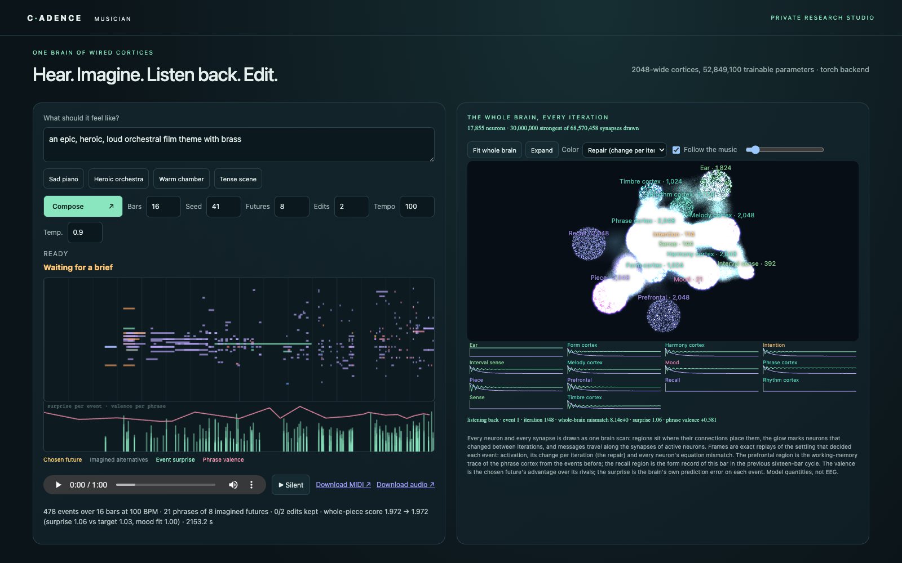

# Cadence examples

**Five official examples for state, embodiment, learning and imagination, plus a catalogue of reusable cortices.**

**[Open the gallery →](https://floatingpragma.io/cadence-examples/)**
[Eye & arm](https://floatingpragma.io/cadence-examples/eye-arm/) ·
[C. elegans habitat](https://floatingpragma.io/cadence-examples/worm/) ·
[Composer](https://floatingpragma.io/cadence-examples/composer/) ·
[Fly-inspired forager](https://floatingpragma.io/cadence-examples/fly/) ·
[Connect Four](https://floatingpragma.io/cadence-examples/connect-four/)

[Cadence](https://github.com/muellerberndt/cadence) builds brains from graded
neurons with bounded local state, declared synapses, readback, retained records and local
feedback. Each task connects labeled regions into **one shared equilibrium**:
local activity changes propagate through the same joint state. Change its world and watch
the next settling cascade. The brain panel reports the equation error.
[How the brains are coupled](COUPLED_BRAINS.md).

## Launch any example

From this checkout, run one command. The four browser demos need Python 3.11+ only:
no packages, account, GPU or training run. The browser opens automatically and the
server picks an available local port. Ctrl-C stops it.

| Example | Command | Try it |
|---|---|---|
| **Eye & arm** | `python serve.py eye-arm` | Draw on the left pad; watch the eye and motor neurons copy it with a jointed arm |
| **C. elegans habitat** | `python serve.py worm` | Place food, draw walls, erase a passage; switch to Circuit to inspect neurons |
| **Composer** | `python serve.py composer` | Describe a mood; maestro-1 imagines continuations, listens to its draft and edits the weakest passage. Needs [its requirements and model](composer/README.md) |
| **Fly-inspired forager** | `python serve.py fly` | Move flowers and change nectar while each encounter updates memory |
| **Connect Four** | `python serve.py connect-four` | Play against the reasoner, inspect future replies, and toggle its self-monitor |

`python serve.py` opens the eye and arm. Use `--no-browser` to print the address, or
`--port 8765` to select a fixed port. Each demo has its own folder and website URL
and title; the navigation links open the individual pages. Assets and computation stay local.

## What the comparisons show

The [advantage contracts](ADVANTAGES.md) state what each example measures and
which conventional controls also work. On the recorded distinct-key stream,
both fast and consolidating synaptic memory give **100% recall**. The
[measured runtime table](ADVANTAGES.md#measured-processing-time) compares their
costs with MLPs at three update budgets, including all writes and queries.
The strategy agent wins **8/8** scheduled games against one-ply evaluation and
**5/8** against four-ply search. These are small, reproducible task comparisons,
not evidence that transformers cannot reason or that every demo is faster.

A separate [history-required test](benchmarks/memory/README.md#history-required-recall)
shows 100% recall after changed lessons versus a provable 25% ceiling for any
fixed predictor receiving only the current cue. A conventional history store
also reaches 100%; giving a transformer the lesson history removes this restriction.

## Live composite brains



The composer ships a pretrained musician, maestro-1, trained on public-domain and CC0
scores ([model card](composer/MODEL_CARD.md)). The forager learns live from a fresh state. The
arm uses a supplied feedback controller. C. elegans includes its public chemical
graph, an engineered habitat/body adapter and a trained MLP circuit comparator.

Each page places its actual circuit beside the body on desktop, grouped by
function. The map includes **every neuron and directed synapse**. Wheel or pinch to
zoom, drag to pan, and use **Fit whole brain** or **Expand**. Region colors mark
functions; activation, mismatch and plasticity provide separate overlays.
Watch sampled settling cascades, inspect local state and memory writes,
or release input in an isolated copy to see recurrent decay. Labeled behavior
colors identify seeking, correction and positive outcomes. The layout stacks on
mobile. [Read the circuit view](METHODS.md#read-the-brain-view).

Flat region maps show current mismatch, repairing neurons and changed messages.
Drag the repair timeline or step with the arrows to inspect each iteration.
Connect Four also exposes the actual value evaluations inside its imagined futures.

Every browser demo explains its starting state, how to observe learning or feedback,
and **why Cadence fits the task**, including the relevant conventional controls.
See the [two-minute guide](METHODS.md#a-two-minute-demonstration),
[starting states](METHODS.md#ready-to-run-and-watch-learning) and
[comparison methods](METHODS.md#results-and-comparison-contract).

The habitat follows local food cues around walls and consumes food patches on
contact. A directional sensory/motor circuit selects body steps. Diffusion,
body mechanics and consumption are supplied
rules. The chemical circuit gates body movement; this is not validated worm
locomotion or digestion. The fly body is simplified too. The
comparisons measure specific memory, circuit and control tasks.

## Reproduce and test

Serving the websites needs no dependencies. For numerical reproduction:

```bash
python -m venv .venv
source .venv/bin/activate
python -m pip install -r requirements-reproduce.txt pytest playwright
python tools/verify.py
node tools/habitat_benchmark.mjs
node tools/nervous_system_benchmark.mjs
node tools/coupled_brain_benchmark.mjs
node connect-four/benchmark.mjs
python -m pytest -q tests
python -m playwright install chromium
python tools/showcase_pages.py
```

Use Node 20+ for the browser-kernel tests. On Windows, activate the environment
with `.venv\Scripts\Activate.ps1`. To rebuild every model, receipt and website, install PyTorch and run
`python tools/rebuild.py`. Full model training needs PyTorch;
see [reproduction commands](METHODS.md#reproduce). The evidence retains
sources, budgets, controls and comparison limits. `python tools/build_showcase.py`
regenerates the four browser pages and gallery from the authored shells.
The composer has its own tests and training commands in [composer/README.md](composer/README.md).

MIT licensed. Public worm data attribution is in [the methods](METHODS.md#biological-sources-and-data-attribution).

## Separate examples

| Folder | Owns |
|---|---|
| [eye-arm](eye-arm/) | Pixel-sensing brain, joint/pencil motor controller, drawing-pad view and evidence |
| [worm](worm/) | Chemical-circuit/body controller, habitat view and evidence |
| [composer](composer/) | Musician brain, trainers, studio, tests and the maestro-1 model card |
| [fly](fly/) | Nectar-memory controller with turn/propulsion neurons and evidence |
| [connect-four](connect-four/) | Game rules, value circuit, bounded search, self-monitor and playable view |
| [cortices](cortices/) | Catalogue of basic cortices (senses, association, motor, working memory, clocked record, conditioning) with an assembly helper and tests |

Each folder has its own `index.html` and entry point. `shared/` holds the common
rendering and numerical code, `evidence/` the cross-example receipts and
`tools/` their producers. The gallery links
the five pages. The full control path is documented in each example; supplied
encoding, attention and body physics remain explicit. These are complete
controllers for the simplified tasks, not whole biological nervous systems.
