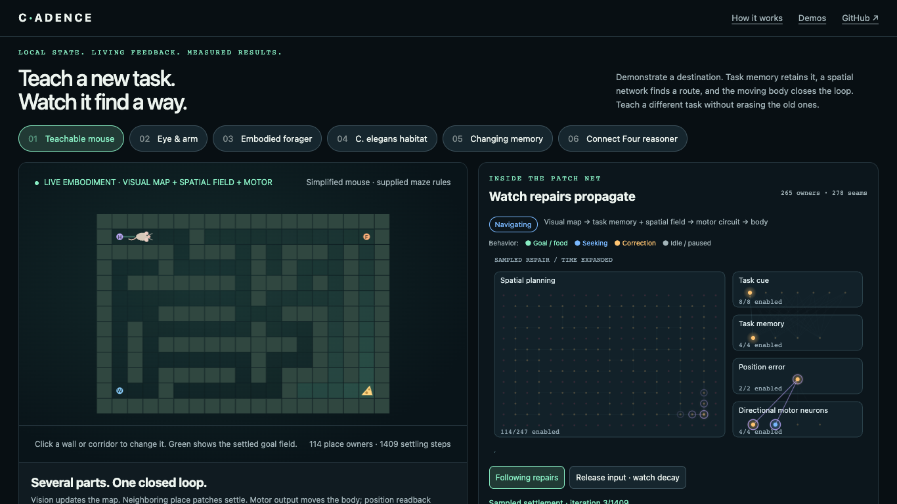

# Cadence examples

**Six interactive websites for state, embodiment and learning.**

[Cadence](https://github.com/muellerberndt/cadence) builds observer-like software
patches: bounded local state, declared ports, readback, retained records and local
feedback. These demos make the loop visible and let you change its world.

## Launch any demo

From this checkout, run one command. Python 3.11+ is sufficient: no packages,
account, GPU or training run required. The browser opens automatically and the
server picks an available local port. Ctrl-C stops it.

| Website | Command | Try it |
|---|---|---|
| **Teachable mouse** | `python serve.py mouse` | Teach a new destination, revise the lesson, then transfer it to a new maze |
| **Eye & arm** | `python serve.py eye-arm` | Draw on the left pad; watch the eye and motor neurons copy it with a jointed arm |
| **Fly-inspired forager** | `python serve.py fly` | Move flowers and change nectar while each encounter updates memory |
| **C. elegans habitat** | `python serve.py worm` | Place food, draw walls, erase a passage; switch to Circuit to inspect neurons |
| **Connect Four** | `python serve.py connect-four` | Play against the reasoner, inspect future replies, and toggle its self-monitor |
| **Changing memory** | `python serve.py memory` | Teach once, replace a record, and compare online MLP updates |

`python serve.py` opens the mouse. Use `--no-browser` to print the address, or
`--port 8765` to select a fixed port. Each demo has its own folder and website URL
and title; the navigation links open the individual pages. Assets and computation stay local.

## What the comparisons show

The [advantage contracts](ADVANTAGES.md) state what each example measures and
which conventional controls also work. On the recorded distinct-key stream,
Cadence memory gives 100% retention and about **52× lower processing time** than
the MLP with 100 updates per observation (about **3×** versus one update).
The strategy agent wins **8/8** scheduled games against one-ply evaluation and
**5/8** against four-ply search. These are small, reproducible task comparisons,
not evidence that transformers cannot reason or that every demo is faster.

## Live composite brains



The mouse comes with three supplied demonstrations and saves additional lessons
in this browser. The forager and memory demo learn live from a fresh state. The
arm uses a supplied feedback controller. C. elegans includes its public chemical
graph, an engineered habitat/body adapter and a trained MLP circuit comparator.

Each website places its actual circuit beside the body on desktop, grouped by
function. Watch sampled repair cascades, inspect local state and memory writes,
or release input in an isolated copy to see recurrent decay. Labeled behavior
colors identify seeking, correction and positive outcomes. The layout stacks on
mobile. [Read the circuit view](showcase/README.md#read-the-brain-view).

Every website explains its starting state, how to observe learning or feedback,
and **why Cadence fits the task**, including the relevant conventional controls.
See the [two-minute guide](showcase/README.md#a-two-minute-demonstration),
[starting states](showcase/README.md#ready-to-run-and-watch-learning) and
[comparison methods](showcase/README.md#results-and-comparison-contract).

The habitat follows local food cues around walls and consumes food patches on
contact. A directional sensory/motor circuit selects body steps. Diffusion,
body mechanics and consumption are supplied
rules. The chemical circuit gates body movement; this is not validated worm
locomotion or digestion. The fly and mouse bodies are simplified too. The
comparisons measure specific memory, circuit and control tasks.

## Reproduce and test

Serving the websites needs no dependencies. For numerical reproduction:

```bash
python -m venv .venv
source .venv/bin/activate
python -m pip install -r requirements-reproduce.txt pytest playwright
python showcase/verify.py
node showcase/habitat_benchmark.mjs
node tools/nervous_system_benchmark.mjs
node connect-four/benchmark.mjs
python -m pytest -q tests
python -m playwright install chromium
python tools/showcase_pages.py
```

Use Node 20+ for the browser-kernel tests. On Windows, activate the environment
with `.venv\Scripts\Activate.ps1`. Full model training additionally needs PyTorch;
see [reproduction commands](showcase/README.md#reproduce). The evidence retains
sources, budgets, controls and comparison limits. `python tools/build_showcase.py`
regenerates the six websites and gallery from the authored shells.

MIT licensed. Public worm data attribution is in [the methods](showcase/README.md#biological-sources-and-data-attribution).

## Separate examples

| Folder | Owns |
|---|---|
| [eye-arm](eye-arm/) | Pixel-sensing brain, joint/pencil motor controller, drawing-pad view and evidence |
| [mouse](mouse/) | Spatial controller with motor neurons, mouse view and evidence |
| [worm](worm/) | Chemical-circuit/body controller, habitat view and evidence |
| [fly](fly/) | Nectar-memory controller with turn/propulsion neurons and evidence |
| [memory](memory/) | Associative-memory subsystem and measured runtime comparison |
| [connect-four](connect-four/) | Game rules, value circuit, bounded search, self-monitor and playable view |

Each folder has its own `index.html` and entry point. `showcase/` holds shared
rendering, numerical utilities and reference benchmark assets. The gallery links
the six pages. The full control path is documented in each example; supplied
encoding, attention and body physics remain explicit. These are complete
controllers for the simplified tasks, not whole biological nervous systems.
