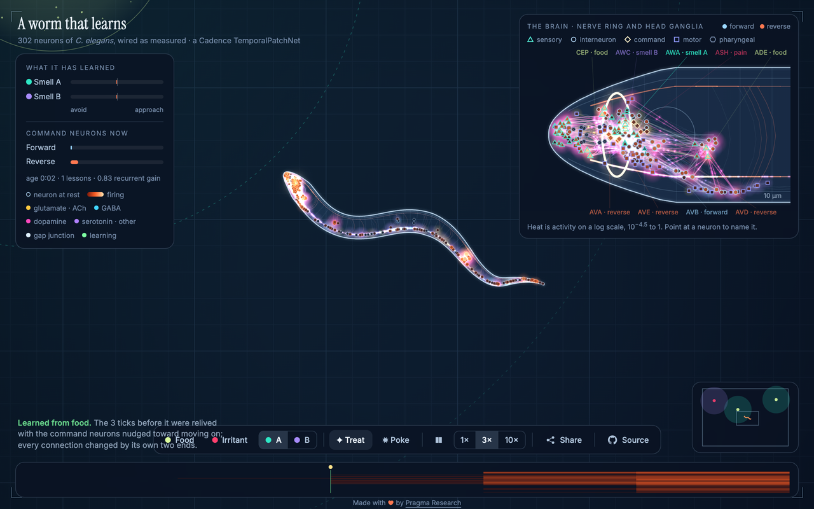
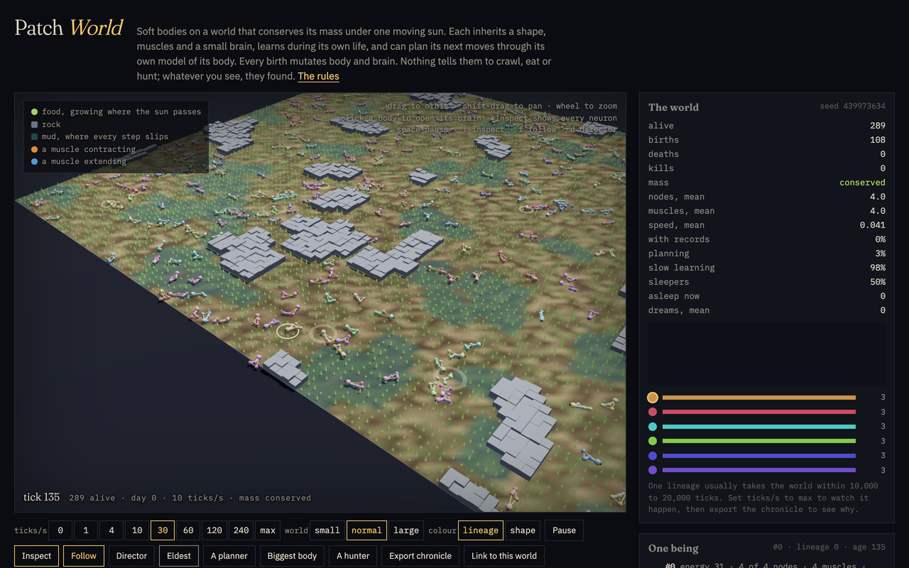
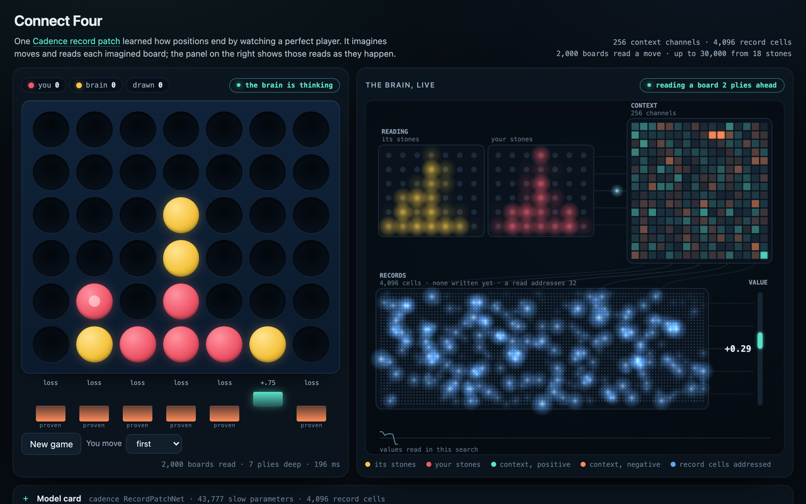
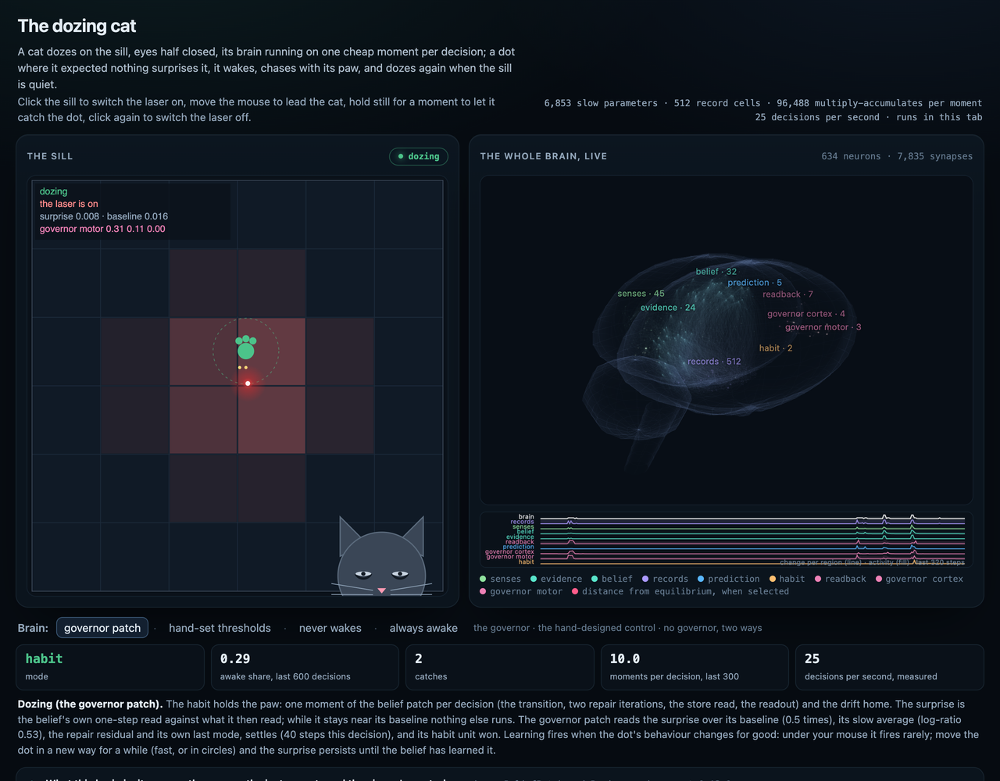
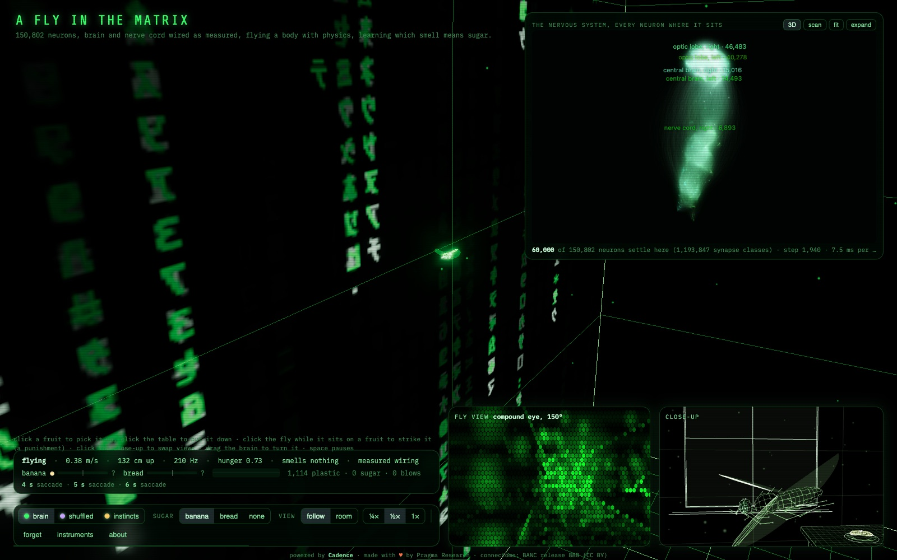

# Cadence examples

Six worked examples for [Cadence](https://github.com/muellerberndt/cadence). Each is one directory
with its own README, its page, the receipts behind every number it states, and a check that
recomputes them. Each page runs its brain in the browser with the arithmetic of the library, and a
parity test holds the two together. The pages are live on
[floatingpragma.io](https://floatingpragma.io/cadence/) and run from a static folder.

<table>
<tr>
<td width="50%"><a href="https://floatingpragma.io/cadence-examples/celegans/"></a><br><b>The worm</b> · <a href="https://floatingpragma.io/cadence-examples/celegans/">live</a> · <a href="worm/">source</a></td>
<td width="50%"><a href="https://floatingpragma.io/cadence-examples/amen-beats/"></a><br><b>Amen</b> · <a href="https://floatingpragma.io/cadence-examples/amen-beats/">live</a> · <a href="amen/">source</a></td>
</tr>
<tr>
<td><a href="https://floatingpragma.io/cadence-examples/patchworld/"></a><br><b>Patch World</b> · <a href="https://floatingpragma.io/cadence-examples/patchworld/">live</a> · <a href="patchworld/">source</a></td>
<td><a href="https://floatingpragma.io/cadence-examples/connect4/"></a><br><b>Connect Four</b> · <a href="https://floatingpragma.io/cadence-examples/connect4/">live</a> · <a href="connect4/">source</a></td>
</tr>
<tr>
<td><a href="https://floatingpragma.io/cadence-examples/dozing-cat/"></a><br><b>The dozing cat</b> · <a href="https://floatingpragma.io/cadence-examples/dozing-cat/">live</a> · <a href="dozing-cat/">source</a></td>
<td><a href="https://floatingpragma.io/cadence-examples/fly-matrix/"></a><br><b>A fly in the Matrix</b> · <a href="https://floatingpragma.io/cadence-examples/fly-matrix/">live</a> · <a href="fly-matrix/">source</a></td>
</tr>
</table>

The examples share principles: bounded state, explicit ports, readback and feedback from
experience. Their models and learning rules differ; each example names its mechanisms and
checks the capabilities it demonstrates.

| Example | What it shows | The brain | Evidence | Check |
|---|---|---|---|---|
| [worm](worm/) | Learning from experience in one life, simple affect (food and pain), neural command readouts, a measured connectome as the only wiring | The 302 neurons of *C. elegans*, each one declared patch of one `Cortex`, its synapses the only connections | the browser engine reproduces the library to a relative difference of 4.8e-8 along ticks and lessons it lives through; the body holds its invariants under stress | [parity](worm/tests/parity.mjs), [body](worm/tests/body.mjs) |
| [amen](amen/) | Creation: from silence it computes sixteen bars of drums, bass and texture, hearing each half-beat it plays | One `RecordPatchNet`: 128 context channels, 8,192 record cells | on held-out tracks, next drum slice 0.85 to 0.88 (most frequent slice 0.03 to 0.05), next bass note 0.41 to 0.64 (repeat previous 0.13 to 0.52), texture error 0.080 to 0.134 (repeat previous 0.099 to 0.173); browser engine equal to the library on 128 half-beats | [receipt](amen/runs/record-composer-v12/receipt.json), [verify](amen/verify.py) |
| [patchworld](patchworld/) | Evolution of bodies and wiring, learning in one life, planning through a learned model, muscles driven directly, drives, computation priced in mass | Two `RecordPatchNet`s per being, a policy and a model, each a list of inherited cortices | the browser brain reproduces the library to 1e-15 on observation, windows, backtracking and planning; mass is conserved at every tick; in two worlds of 20,000 ticks mean speed rises from 0.040 to 0.071 and from 0.042 to 0.063 cells per tick | [parity](patchworld/sim/parity.js), [physics](patchworld/tests/physics.test.js) |
| [connect4](connect4/) | Planning: a search over imagined boards reads a value learned by watching a perfect player, and every move is graded by that player | One `RecordPatchNet`: 256 context channels, 4,096 record cells left empty by the school | 40-0-0 against AlphaZero at 25 and at 100 simulations; 37-1-2 against the perfect solver playing 70% of its moves, a rules-only control with different search and budget scores 28-2-10; moving first against the perfect solver 10-9-1 with 0.893 of its moves optimal, the control 0-0-20; the browser engine selects the library's record cells and agrees with its values to 1e-15 | [receipt](connect4/web/receipt.json), [verify](connect4/verify.py) |
| [fly-matrix](fly-matrix/) | An imported nervous system choosing food goals for a supplied flight controller, with local learning from an enacted choice and its outcome | `cadence.Brain` on 150,802 retained BANC neurons and 1,877,099 directed edge classes; an external actor-critic drives local Kenyon-cell-to-MBON updates | one full-graph synthetic rewarded lesson changes approach probability from 47.39% to 71.09%; exact weight restoration and reinstatement recover both responses; browser checks witness a neural choice, feeding and a matched synaptic update | [causal receipt](fly-matrix/receipts/goal_learning_causal_2026-09-27.json), [browser receipt](fly-matrix/receipts/release_0_17_local_learning.json), [checks and scope](fly-matrix/README.md) |
| [dozing-cat](dozing-cat/) | Metacognition: a brain that reads its own surprise and returns its mode (doze, chase, learn), the governor a settling patch whose every synapse is a gene, selected against hand-set thresholds and a random search at a priced compute | One `BeliefPatch` (32 units, a 512-cell store left empty) and one `Brain` of 14 neurons as the governor | the evolved governor catches 0.961 of its dots awake 0.24 of the time at 15.3 moments per decision, against 0.977 at 37.3 hand-set, 0.931 for the thresholds and 0.249 for a cat that never wakes; the browser brain reproduces the library's decisions, imagination and learning to 4.8e-12 on the committed recording | [receipts](dozing-cat/receipts/), [parity](dozing-cat/tests/parity.mjs), [verify](dozing-cat/verify.py) |

## Choose a current layout

Cadence 0.50.0 supports three design patterns. **All three settle under the same
patch rule, repair procedure and qualification checks.** Choose the wiring that
fits the task and measure its behavior and cost.

| Pattern | Wiring | A useful starting point for |
| --- | --- | --- |
| Flat, input-only | Patches read fixed sensory inputs independently | Small direct sensor-to-action relations |
| Ordinary state-coupled | Columns read other columns' live states | Learned intermediate representations |
| Recursive observation | Observers read states and exact live prediction errors; observers can observe observers | Tasks where feedback about internal errors improves behavior |

See the canonical [layout guide](https://github.com/muellerberndt/cadence/blob/main/docs/VARIANTS.md)
and [performance guide](https://github.com/muellerberndt/cadence/blob/main/docs/PERFORMANCE.md)
for construction examples and measured comparisons. A flat current brain still
settles; extra observation depth is an optional design choice.

The examples below retain their own versions and mechanisms. The worm's 0.50
source uses ordinary state-coupled columns with feedback across ticks. Amen,
Connect Four and Patch World use legacy gated record patches; the cat combines
a belief patch with a separately settling governor; the fly uses a recurrent
neuron-rate network. Their temporal loops, search and older equilibrium solvers
are distinct from the current state-and-error observer wiring. Each example's
guide explains its layout and links to the current choices.

## Build your own

These six are starting points, and the best thing you can do with them is break them. Fork the
repository, change a rule, swap a sense, grow a different body, school a stronger player, train a
composer on other music, wire two of the brains together, and see what the same few operations can be
made to do. Every brain is short enough to read in an evening, every page runs from a static folder,
and every check runs from one command, so a change shows at once whether it kept the numbers or
broke them.

The legacy connectome browser engine used by the fly, with a guide for building an example on that model
(the payload, the settle loop, the viewer, the lessons, the parity test, the page conventions),
is in [engine/](engine/README.md).

The whole-brain viewer every page draws with (the atlas layout and `brain_scan.js`) is in
[viewer/](viewer/README.md), and the three smallest demos, the library quickstart's brains behind a
local page, are in [quickstart/](quickstart/README.md); the library ships the brains alone.

Then build an example of your own. Every example, finished or half-working, is data for us: it says
what the architecture does with a body, a sense or a task that nobody has put in front of it, and
that is what scales this work toward the full humanoid simulation. Hack things. Be crazy. Chaos is
how we learn. The library is [Cadence](https://github.com/muellerberndt/cadence); open an issue or a
pull request in either repository, and when your example carries a card (see
[Contributing](#contributing)) it can live here beside these six.

## A fly in the Matrix

The retained brain and nerve cord of an adult female fruit fly run as one `cadence.Brain`
of 150,802 neurons, drawn at their measured soma positions beside the body's compound-eye view.
The brain receives engineered sensory inputs and chooses an approach or avoidance goal;
a supplied body controller handles navigation, balance, landing and grooming in the wireframe
room. An enacted choice and its outcome can change the mushroom body's Kenyon-cell-to-MBON
synapses through local phase contrasts and an external actor-critic. A full-graph causal check
shows one rewarded lesson changing the later response, while browser checks connect neural
choice, physical feeding and a matching update. These demonstrate a working perception,
action and learning loop; learning the flight path and reliable room-wide food preferences
remain open. Historical physiology and subset-learning results are identified separately in
the [example's guide and receipts](fly-matrix/README.md).

## The dozing cat

One `BeliefPatch` watches a sill through a coarse retina and predicts how the laser dot and its own
paw will move. Its surprise, the one-step read against what then arrived, is read off a readback
port by a governor: a settling `Brain` of fourteen neurons whose every synapse is a gene, and whose
settled motor state is the mode. Dozing is one moment of the patch per decision; chasing is ten
pushes imagined in the belief's private imagination; learning is `observe` on the executed window,
kept only when the window's loss fell. The governor was selected against hand-set thresholds and a
random search at a priced compute, and the page runs the genome that won on held-out lives, the
whole brain in the browser beside the sill, your mouse as the laser. Details, receipts and what it
does not do: [dozing-cat/README.md](dozing-cat/README.md).

## The worm

The worm's brain is its connectome: every neuron is one declared patch of one `Cortex`, and its
declared inputs are exactly its synapses — chemical, gap junctions both ways, and its own state
a tick ago — so nothing else can grow. Synapses running toward the commands act live within a
tick's joint settlement; synapses running back act across ticks. Smells reach the olfactory
neurons AWA and AWC, bacteria the dopaminergic CEP, ADE and PDE, pain the ASH nociceptors. The
body reads the command interneurons through two learned drive readouts: AVB and PVC drive it
forward, AVA, AVD and AVE drive it backward. When food or pain arrives, the worm relives the
moments that led there as one qualified batch and learns what its command drives should have
been doing on the way. Details, sources and limits: [worm/README.md](worm/README.md).

## Connect Four

One `RecordPatchNet` reads a position right after a stone has landed, as the side that placed it
sees it, and says how the game ends for that side. It learned that by watching Pascal Pons'
perfect solver play out set-up positions to the end: it saw the games and how they ended, and
the solver's scores were never recorded. Its slow parameters carry what it learned; its record
store is left empty, because writing millions of positions into it drowns it (on three runs the slow readout alone names the winner 3 points more often on positions it never saw and 2 points more often on positions it witnessed:
[receipt](connect4/receipts/records_drown.json)). A supplied search knows the rules,
imagines moves and reads the patch where it stops looking; a line it can follow to the end of
the game is proven. Measured on the build the page plays, 40 paired games against each
opponent with every move graded by the solver: the learned player's results, a rules-only
control with a different search budget, and where it still errs are in [connect4/README.md](connect4/README.md). It does not yet
learn from the games played on its page.

## The composer

One record patch learned sixteen jungle tracks as events per half-beat. The page ships the
trained brain: it starts from silence, hears each half-beat it plays, computes a track in the
browser and plays it with its activity in time with the sound. Details, receipts and what it
does not do: [amen/README.md](amen/README.md).

## Patch World

A torus of soil, food, rock and mud under one moving sun, with mass conserved at every tick.
A body is a graph of point masses, springs and muscles that crawls by grip alone; it is born
with three nodes and grows the rest. Its brain is two record patches: a policy that proposes the
motor and a model that predicts what the motor will change, each a list of cortices that read
their own part of the senses. Every birth mutates shape, limbs, muscles and cortices; energy and
death select, and the world has no fitness function. Click any body to open its brain; `Inspect`
draws every neuron, weight, record cell and motor neuron live beside the moving body. The page
exports a chronicle of every lineage, and `patchworld/sim/why.py` reads it and says why one
lineage took the world. Details, evidence and limits: [patchworld/README.md](patchworld/README.md).

## Run them locally

Every page is a static folder: serve it and open it. Each README has the details for its example.

```bash
python -m http.server -d worm/web 8801          # then open http://127.0.0.1:8801
python -m http.server -d connect4/web 8802      # then open http://127.0.0.1:8802
python -m http.server -d amen/web 8803          # then open http://127.0.0.1:8803
python -m http.server -d patchworld/web 8804    # then open http://127.0.0.1:8804
python -m http.server -d dozing-cat/web 8805    # then open http://127.0.0.1:8805
```

Every example is verified against the Cadence release its checks pin (0.50.0 for the worm, 0.12.0 for connect4, amen and patchworld, and for the dozing cat the library's commit `f06eab06` after 0.13.0, where the belief patch's boundary state landed): its receipts are replayed, its exports rebuilt and its browser engine checked against the library at that release. A receipt names the commit its own numbers were produced with. The same checks run in CI on every push.

```bash
# worm: the library at its own pin
python -m pip install "cadence-net==0.50.0" numpy scipy pytest
python worm/tools/export_web.py && node worm/tests/parity.mjs && node worm/tests/body.mjs

# connect4, amen and patchworld: the library at theirs
python -m pip install "cadence-net==0.12.0" scipy

# connect4
python connect4/verify.py
python connect4/web/export.py --patch connect4/brain/v2.npz --out /tmp/connect4 && node connect4/web/parity.mjs /tmp/connect4

# amen: the receipt names its library commit; verify.py also runs the browser parity under node
python amen/verify.py

# patchworld
python patchworld/ref/make_fixture.py --out /tmp/patchworld_fixture.json && node patchworld/sim/parity.js /tmp/patchworld_fixture.json
node patchworld/tests/physics.test.js

# dozing-cat: the library at the commit its checks pin
python -m pip install "cadence-net @ git+https://github.com/muellerberndt/cadence@f06eab065803a61e92fc2f578f24e91eaee48e79"
python dozing-cat/verify.py && node dozing-cat/tests/parity.mjs && node dozing-cat/tests/chaos.mjs
```

`python tools/screenshots.py` photographs the five pages in action into each example's
`screenshot.png` (needs `playwright` with its Chromium and `pillow`).

## Contributing

Issues and pull requests are welcome, and so is a new example. The repository is MIT licensed, and a
contribution is accepted under that licence. An example lives in one directory with:

- a README that opens with a title paragraph, a screenshot linking to the live page, a "Live page"
  line and the card below;
- a static page under `web/` that runs the brain in the browser with the library's arithmetic, and
  a parity test that holds it to the library;
- the receipts behind every number the README states, and a check that recomputes them from the
  repository root against the release the checks pin;
- a `Run it locally` section with the commands, from the repository root.

Every example README carries a card: the same rows in the same order, so that a reader can compare
examples at a glance and a contributor knows what to write down. Copy it and fill in every row. Write
"none" where a row does not apply, and update the card whenever the brain is retrained or the page
moves.

```markdown
## Card

- **Name:** the demonstration's name
- **Author:** who built it
- **Description:** two or three sentences on what the brain does and what the page shows
- **Cadence version:** the release the brain was trained on, and the release the checks pin
- **Hardware for initial training:** machine, CPU or GPU, wall-clock time, and the size of the data
- **Cadence features showcased:** the classes, calls and mechanisms of the library the example exercises
- **Problems encountered during development:** what went wrong, what it showed, and what changed because of it
- **Hosted at:** the live URL, or "none"
- **Receipts and checks:** the files every stated number comes from, and the command that rechecks them
- **Data and rights:** what the brain was trained on, where it came from, and whether it may be redistributed
- **Work in progress:** what a contributor can pick up
```

A half-working example with a filled card and a clear "Work in progress" row is welcome. The card is
what tells us what you found, and the problems row is often the most useful part of it.

Made with ♥ by [Pragma Research](https://floatingpragma.io).
