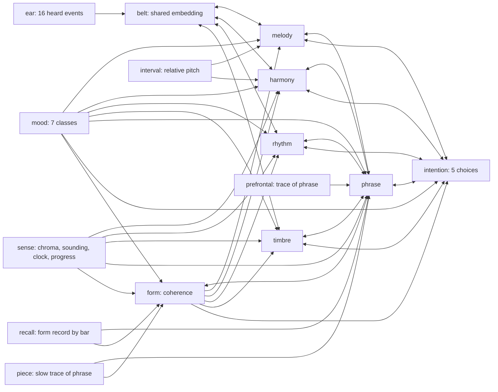

# The musician

One brain, built from scratch as a set of wired cortices, that hears music, holds the
phrase in mind, remembers the form of the piece, feels a mood, and intends the next
event. It learns by imitation of whole pieces heard as streams. It composes by
imagining continuations through its own predictions, listens to the whole draft and
edits the passages that are weakest by its own measure. Code: `composer/musician.py`,
`composer/listen.py`, `tools/prepare_musician.py`, `tools/train_musician.py`,
`tools/baseline_musician.py`, `tools/compose_musician.py`, `tests/test_musician.py`.

The region names below follow the parts of a human composer's brain that carry the
same function. They are engineering analogues in one Cadence connectome, not an
anatomical model; every region is a contiguous range of graded neurons that settles in
the same joint equilibrium as every other region.

## The wired cortices

| Region | Neurons (large) | After | Reads | Writes |
|---|---:|---|---|---|
| `ear` | 1,824 | primary auditory cortex, echoic memory | the last 16 heard events, one-hot (pitch, duration, time to attack, instrument family, velocity) | clamped input |
| `sense` | 144 | auditory belt and parietal clock | chroma of what was heard, notes sounding now by family, beat in bar, bar in a 16-bar cycle, progress through the piece | clamped input |
| `mood` | 21 | limbic conditioning | seven measured mood classes of the piece | clamped input, projects into every cortex and the intention |
| `belt` | 1,024 | auditory belt | one embedding of each heard event; the synapses from the ear are **tied across the 16 window positions**, so one ear hears every position | melody, harmony, rhythm, timbre (reciprocal) |
| `melody` | 2,048 | right superior temporal contour processing | belt | phrase, intention (reciprocal) |
| `harmony` | 2,048 | tonal expectation (superior temporal, inferior frontal) | belt, chroma, sounding notes | phrase, intention (reciprocal) |
| `rhythm` | 1,024 | timing loop (supplementary motor area, basal ganglia) | belt, beat, bar, progress | phrase, intention (reciprocal) |
| `timbre` | 1,024 | orchestration (auditory belt, insula) | belt, sounding notes by family | phrase, intention (reciprocal) |
| `phrase` | 2,048 | association cortex | the four cortices, the working memory, the form record, the mood | intention (reciprocal) |
| `prefrontal` | 2,048 | dorsolateral prefrontal working memory | a `Trace` of the phrase cortex from the events before (decay 0.85) | phrase |
| `recall` | 2,048 | hippocampal form memory | a per-piece delta-rule record keyed by the bar of the 16-bar cycle: what the phrase cortex held at this bar one cycle ago | phrase |
| `interval` | 392 | relative-pitch sense (version 2) | the pitch step from each of the last eight heard events to the one before it, two octaves either way | clamped input into melody and harmony |
| `form` | 1,024 | coherence of the piece as a whole (version 2; medial prefrontal planning) | the clock and progress, the mood, the slow trace of the piece so far, the form record | phrase (reciprocal), every specialised cortex and the intention from above |
| `piece` | 2,048 | the piece so far (version 2; a second working memory) | a slow `Trace` of the phrase cortex (decay 0.98, about a hundred events) | form, phrase |
| `intention` | 114 | premotor intention | everything above | read as five softmax choices: pitch 73, duration 12, time to attack 13, family 8, velocity 8 |

Version 1 (without interval, form and piece), large: 15,415 neurons, 49.2M directed
synapses, 29.3M trainable parameters. **Version 2, large: 18,879 neurons, 70.1M directed
synapses**, the design trained on 2026-09-14. Reciprocal pairs share one efficacy and the
tied ear table counts once. Medium (cortex 1,024, phrase 1,024) is about a third of each.

Two time constants of memory carry coherence: the phrase working memory forgets in a
handful of events, the piece trace in about a hundred, and the form record returns what
the phrase cortex held at the same bar a cycle earlier. The form cortex reads all three
with the mood and the clock and biases every other cortex from above, which is where
"the piece as a whole" enters each next event.

**The belt was dropped in the trained design.** With the belt (a free population between the
ear and the cortices) every run plateaued near 1.20 held-out surprise; with the ear
projecting straight into the four cortices (`Design(belt=False)`, `--no-belt`) the same
brains reached 1.05 (medium) and were still falling at large size. The extra stage
weakened the two-phase contrast reaching the ear-side synapses. The tied shared
embedding is kept as an option, not as the recipe.

**Every free neuron starts with a tonic bias of 1.0.** The learning neuron model is a
rectified sigmoid that is exactly zero at rest, so a neuron whose random input sums below
zero is silent and carries no contrast; with symmetric random projections half of every
stage was silent and the two-phase contrast reaching the ear-side synapses was tiny. The
bias puts every stage on the slope of its activation function. The learning rate is
0.005: the 0.16 of the earlier polyphonic design, tuned for contrasts fifteen times
smaller, kicked every synapse by about one percent of its magnitude at once and froze
the net at the output marginals (`runs/` diagnostics of 2026-09-14).

Every arrow is a block of actual synapses. The two memory regions receive no synapses:
the working memory is written by a `Trace` after each real event, the form record by a
`FastSynapses` delta rule at the start of each bar; both enter the next equilibrium as
stimulus and the phrase cortex reads them through learned synapses. This is the
[fading context](https://github.com/muellerberndt/cadence/blob/main/docs/notes/patterns.md#fading-context) and
[records addressed by time](https://github.com/muellerberndt/cadence/blob/main/docs/notes/patterns.md#records-addressed-by-time)
patterns inside one joint solve.

## What the mood input is

Seven classes measured on every training piece, and supplied by the brief when composing:

| Class | Values | Measured from |
|---|---|---|
| mode | major, minor | tonal center |
| tempo | slow (<90), moderate, fast (>130) | the score's tempo |
| energy | sparse, moderate, dense | median gap between distinct onsets |
| dynamics | flat, soft, medium, loud | distinct velocities and their mean |
| register | low, middle, high | mean pitch |
| texture | solo, chamber, orchestral | number of instrument families |
| tension | consonant, colored, chromatic | fraction of notes outside the key |

A brief such as "sad slow orchestral" maps by keywords onto these classes
(`tools/compose_musician.py`, a bounded parser, not language understanding). The
mood region projects into every cortex and the intention, so the same synapses that
learned how dense, dark or orchestral music continues are what a mood request drives.

## Learning: imitation of whole pieces as streams

`tools/prepare_musician.py` turns every accepted PDMX score into one stream: events in
fixed order, the sense row before each event (from the same `Senses` class the composer
uses when it plays), and the piece's mood. Corpus prepared 2026-09-14: 65,188 training
pieces (46.8M events), 3,965 validation (3.0M), 3,436 test (2.5M), split by composition
family before training; all genres of the public-domain pool, solo and multi-track.

`tools/train_musician.py` walks 256 pieces in parallel. Each update advances every
stream by one event: one free phase from the previous equilibrium with the working
memory and form record written in, two nudged phases toward and away from the heard
event, one local update of every synapse from its own two-phase contrast. A stream whose
piece ends starts the next piece with its working memory, form record and warm state
reset. There is no backpropagation graph and no replay buffer. The control
(`tools/baseline_musician.py`) is a GRU over the identical streams, trained by
backpropagation through time, evaluated on the same held-out streams.

## Composing: imagine, commit, listen, edit

1. **Prime.** Sixteen quiet events set the key, register and texture. They are heard, not
   written into the piece.
2. **Imagine.** `Musician.imagine` copies the stream state into eight batch rows and rolls
   each forward through the brain's own predictions to the end of the next two bars: every
   row hears its own last events, its own working memory and its own form record. The
   `Listener` scores each future: distance of the brain's own surprise from the surprise it
   feels on real music, fit of the measured mood classes to the brief, and explicit
   health checks. The winner's events and its stream state are committed; its advantage
   over the other futures is the valence of the phrase.
3. **Listen.** `Musician.review` hears the whole draft from the start in one fresh stream
   and records the surprise of every event and a state snapshot at every bar.
4. **Edit.** The weakest four-bar passage is re-imagined from its snapshot with sixteen
   futures; the rest of the piece keeps its clock. The edit stays only if the whole draft
   scores higher on the same listener. Two rounds by default.

Imagined futures never write the live working memory, form record or synapses
(`tests/test_musician.py::test_futures_are_isolated_and_never_write_the_live_state`).

## Supplied and learned

Supplied: the event vocabulary and encoders, the seven mood classes and the keyword
brief, the beat/bar clock, the trace and record rules and their decay, the listener's
three measures and their weights, the two-bar imagination horizon, the four-bar edit
passage, the opening prime, and the GM program per family when rendering.

Learned: every synapse that decides which pitch, duration, timing, family and velocity
comes next, in the ear table, the four cortices, the phrase cortex, the projections from
mood, working memory and form record, and the intention.

Not established by this design: human-level composition, learned long-form structure
beyond what the working memory and the 16-bar record carry, or an advantage over the
GRU control. Those are measured, not assumed; see EVIDENCE.md once the runs complete.
