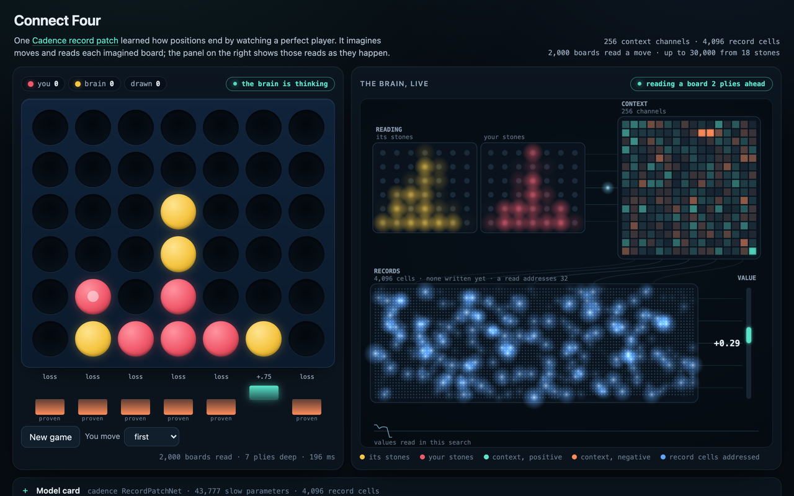

# Connect Four

One `cadence.RecordPatchNet` reads a position right after a stone has landed, as the side that
placed it sees it, and says how the game ends for that side. A supplied search knows the rules,
imagines moves and reads the patch where it stops looking. The page plays it in the browser
with the same arithmetic as the library and draws every sampled read.

[](https://floatingpragma.io/cadence-examples/connect4/)

Live page: [floatingpragma.io/cadence-examples/connect4](https://floatingpragma.io/cadence-examples/connect4/).
The same page runs from this directory; see [Run it locally](#run-it-locally).

## Card

- **Name:** Connect Four
- **Author:** Bernhard Mueller
- **Description:** One record patch reads a position right after a stone has landed and says how the game ends for the side that placed it. A supplied search imagines moves and reads the patch where it stops looking. The page plays it in the browser with the library's arithmetic and draws every sampled read.
- **Cadence version:** 0.12.0. The receipt names library commit `742c6b0b`, the 0.12.0 release.
- **Hardware for initial training:** CPU only. The school of 200,000 solver games (4,444,571 positions) takes about 10 minutes on 94 cores. Six passes over it took 1 hour 45 minutes on an AWS c7i.4xlarge (16 vCPUs) shared with five other training arms. The arena, 200 games with every move graded by the solver, took 18 minutes.
- **Cadence features showcased:** `cadence.RecordPatchNet` as a value function; the two jobs of the slow parameters and the record store, with the store left empty by the school (`observe` with `write=False`); one-moment paths from rest through `imagine` and `observe`; `record_averaging` and `RecordPatchNet.sleep`, measured and left out of the deployed brain; a browser engine that selects the library's record cells and agrees with its values to 1e-15.
- **Problems encountered during development:**
  - Bulk writes drown the record store. On three runs the slow readout alone names the winner 3 points more often on unseen positions than the readout with the record read. The school writes no records.
  - A row of `imagine` is not bitwise invariant to the size of its batch, so the Python search disagreed with itself between runs. The search reads each distinct position once.
  - Record addresses are a similarity kernel. Two moves that differ by one stone share 51 percent of their active cells, and a plain write to one moves the other; an anchored write keeps the sibling in place. Learning from the games played on the page waits on a write path with a no-degradation gate.
  - A fixed slow rate of 0.3 trains 256 context channels and diverges silently at 1,024.
  - The first build (2,229,254 positions, three passes) lost 13 of 20 games going first against perfect play. The deployed build is schooled on twice the positions for six passes and loses 1 of 20.
  - From 16 to 24 stones the search does not always reach the end of the game within its reads, and the blunders concentrate there. A tenfold read budget did not help.
  - Records by day and slow parameters by night were measured. At every matched update count the school is one to three points ahead, so the deployed brain is the schooled one.
  - alpha-zero-general's game package is also named `connect4`, which shadows this directory on import. The AlphaZero bridge is launched by path and loads the wrapper under another name.
  - Social-card tags copied from another page produced no card on X. The page carries explicit Twitter tags, a canonical link and a baseline JPEG.
- **Hosted at:** https://floatingpragma.io/cadence-examples/connect4/
- **Receipts and checks:** `web/receipt.json` (every game and every graded move of the deployed build, bound to the page's files), `receipts/` (records drown, record addresses, the rules-only control, the sleep regime), `verify.py`, `web/parity.mjs`. `python connect4/verify.py` from the repository root.
- **Data and rights:** The school is generated from Pascal Pons' perfect solver and its opening book, and the AlphaZero baseline is trained with alpha-zero-general; `bench/setup_external.sh` fetches both, and neither is redistributed here. School files are regenerated from their seed and are not stored.
- **Work in progress:** learning from the games played on the page; a proof search for the late game; the solver's grade of each move stored move by move in the receipt.

## What this example shows

- **Planning.** The brain chooses a move by imagining boards and reading a learned value where it stops looking. A line it can follow to the end of the game is proven and outranks anything it reads.
- **Learning by watching.** The value comes from games a perfect player played out, seen with how they ended. No score was given.
- **Slow parameters and records have different jobs.** The school trains the slow parameters and leaves the record store empty, because writing millions of positions into it drowns it (measured on three runs). The records are for the games played afterwards; that use is work in progress.
- **Play judged move by move.** A perfect solver grades every move, by the stage of the game, beside a control that searches with no value patch.

## Layout

| file | what it is |
| --- | --- |
| `game.py` | the rules on two 49-bit boards, and the 84-unit reading (a position and its mirror image are one reading) |
| `school.py` | games to learn from: set-up positions played out to the end by Pascal Pons' perfect solver |
| `patch.py` | the value patch: one `RecordPatchNet`, every reading a path of one moment from rest |
| `train.py` | the school: slow parameters only, records left empty, checkpoint chosen on a validation split |
| `deploy.py` | the brain as deployed: empty record store, reading statistics settled through documented calls |
| `brain.py` | the search: iterative deepening, exact wins from the rules, forced blocks, one value per reading |
| `bench/` | the solver bridge, the AlphaZero baseline, `measure.py` (every move graded by the solver) |
| `web/` | the page, its engine (`patch.js`, `brain.js`), parity checks and the arena that produces the receipt |
| `brain/v2.npz` | the deployed patch the page's `brain.json` is exported from |
| `receipts/record_address.json` | what two moves that differ by one stone share in the record store, and what a write to one does to the other, plain and anchored (`tools/record_address.py`, reproduced from this directory alone) |
| `receipts/records_drown.json` | three runs schooled with every position written into the records: the slow readout alone against the value with the record read (`tools/records_drown.py`) |
| `receipts/control_rules_only.json` | the same opponents against the search alone, with no value patch: what the patch adds is the difference |
| `verify.py` | replays every game of the receipt with the rules, recounts its table, and checks that the receipt is bound to the page's brain and engine and that the page's brain is the export of `brain/v2.npz` |
| `tools/make_card.py` | draws the social card with the page itself, mid-thought |

## Run it locally

From the root of this repository, with Python 3 and node installed. The page is static and
plays the brain in `web/brain.json`:

```bash
python -m http.server -d connect4/web 8802     # then open http://127.0.0.1:8802
```

To check that brain and the receipt beside it against the library:

```bash
python -m pip install "cadence-net==0.12.0"
python connect4/verify.py                                                          # the receipt, its games, the page's brain
python connect4/web/export.py --patch connect4/brain/v2.npz --out /tmp/connect4    # what the page reads,
node connect4/web/parity.mjs /tmp/connect4                                         # against what the library reads
```

## Reproduce the brain

    connect4/bench/setup_external.sh                       # Pons' solver, its book, alpha-zero-general
    python connect4/school.py --games 1500 --seed 99 --out runs/connect4/school/big_test.npz
    python connect4/school.py --games 200000 --seed 0 --out runs/connect4/school/big_s0.npz   # 4,444,571 positions; 10 minutes on 94 cores
    python connect4/train.py --school runs/connect4/school/big_s0.npz --heldout runs/connect4/school/big_test.npz --passes 6 --out runs/connect4/big/school_p6
    python connect4/deploy.py --patch runs/connect4/big/school_p6/patch.npz --school runs/connect4/school/big_s0.npz --out runs/connect4/deployed/v2.npz
    python connect4/web/export.py --patch runs/connect4/deployed/v2.npz --out runs/connect4/web_v2
    node connect4/web/parity.mjs runs/connect4/web_v2      # the page reads what cadence reads
    node connect4/web/arena.mjs --brain connect4/web --opponents alphazero=<checkpoint>@25 one_ply solver_070 solver_100 alphazero=<checkpoint>@100 --games 40 --out runs/connect4/web_v2/receipt.json
    python connect4/tools/seal_receipt.py --arena runs/connect4/web_v2/receipt.json --web connect4/web --alphazero <checkpoint> --library-commit <commit> --school-positions 4444571 --passes 6 --unseen 0.9058 --out connect4/web/receipt.json

School files are regenerated from their seed (the same seed gives the same file), so they are
not stored.

## What was measured

The receipt beside the page (`web/receipt.json`) holds every game and every graded move of the
build that is deployed; the page's card renders its table from that file and plays with the
search settings recorded in it.

The deployed build is the slow readout schooled on 4,444,571 positions from 200,000 solver games
(seed 0), six passes, the checkpoint chosen on a validation half of 1,500 held-out games: it names
the right sign for 0.906 of the held-out positions it never saw (the first build, 2,229,254
positions and three passes, 0.873). In the arena, 40 paired games against each opponent: 40-0
against AlphaZero at 25 and at 100 simulations (0.822 and 0.853 of its moves optimal, blunders
when not lost 0.043 and 0.025), 40-0 against one-ply, 37-1-2 against the solver playing its best
move 70 percent of the time, and against the perfect solver 10-9-1 going first and 0-0-20 going
second, with 0.893 of its moves optimal and 0.027 blunders when not lost. From 24 stones it made
no blunder against any opponent. The first build lost 13 of 20 games going first against perfect
play and five of twenty as second against AlphaZero at 100 simulations.

Findings of the build, each with the script that measured it, are collected for the library's
documentation: bulk writing drowns the record store (on three runs the slow readout alone names the winner 3 points more often on positions it never saw and 2 points more often on positions it witnessed;
`receipts/records_drown.json`), so the school leaves the records empty; a row
of `imagine` is not bitwise invariant to the size of its batch, so the search reads each
distinct position once; record addresses are a similarity kernel, so a write also moves the
sibling moves unless they are anchored at their current values (`receipts/record_address.json`: siblings share 51 percent of their active cells; a plain write moves them 0.29 where the written move goes 0.55, an anchored write 0.04 where it goes 0.71).

A second regime was measured and not deployed (`receipts/sleep-2026-09-22/`, `train_sleep.py`):
records by day, slow parameters by night. A day writes every school position once at slow
rate zero; a night is `RecordPatchNet.sleep` on the day's cues, so the slow readout learns
from the store's own dreams with the school closed. One night takes the readout from chance
to 0.755 (4,096 cells), 0.768 (16,384) and 0.772 (65,536) on the held-out sign, against the
school's 0.785 from the same 263 updates on the outcomes themselves; at every matched update
count the school is one to three points ahead, and the dawn readout follows what the store
read at bedtime. An averaging store (`record_averaging`, floor 0.02) is not drowned by a day
of 67,399 writes: it reads unseen positions at 0.778 in 4,096 cells and lifts the schooled
readout from 0.792 to 0.806 when written on top of it, where the last-writers store lowers
it to 0.765. The deployed brain stays the schooled one.

## Open

- The page does not yet learn from the games played on it. The write path and its
  no-degradation test come first.
- From 16 to 24 stones the search does not always reach the end of the game within its reads;
  a dedicated proof search for the late game is the next step.
- `verify.py` replays the receipt's games and binds it to the deployed files. The solver's grade of each move is stored as
  rates per stage of the game, not move by move, so the blunder rates are not recomputed without the solver.

## Build on it

Fork this directory and make a stronger player. The school, the training, the search, the arena and the page are
separate files, so one of them can be replaced while the rest keeps measuring. A proof search for the late game, a
wider school of early positions and learning from the games played on the page are the open ends.
