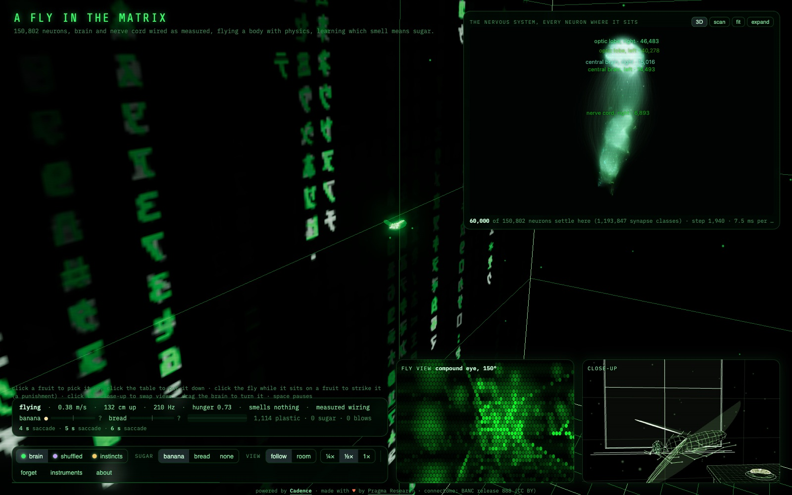

# A fly in the Matrix

The nervous system of an adult female *Drosophila melanogaster*, brain and nerve cord wired as
measured (BANC release 888: 150,802 neurons, 1,861,418 synapse classes carrying 23,104,740
synapses), as one Cadence brain in a physical room. The body is a rigid fly with stroke-averaged
aerodynamics in a three.js room drawn as green wireframe on black, with a table, a banana and a
piece of bread; the page draws the whole nervous system at its measured soma positions with the
settling live, keeps the fly in a permanent close-up, shows what its compound eyes see, and the
fly lives: bouts of flight with saccades, landings, sitting, grooming, feeding, and learning
which smell means sugar. The visitor places the sugar and moves the fruits; a blow on the fly
while it sits on a fruit is a punishment.

The wingbeat belongs to the physics. The fly's power muscles are asynchronous and oscillate at
the thorax's resonance near 200 Hz, so the brain sets the power and steers through a dozen small
steering muscles per side. The equilibrium reflex at that timescale rests on the spike timing of
the haltere afferents, which a rate model cannot carry, so it is supplied by the body as a
hand-written inner loop, the way the worm's undulation is supplied. The brain does what the
wiring carries at the timescale of a rate model: looming to the giant fibre and escape, sugar to
the proboscis, odour through the mushroom body to a choice, landing, grooming, and learning.

The lessons are the mushroom body's. A hungry fly that notices a smell turns toward it by
instinct and hovers over the fruit; there, once per search, the brain decides whether to land on
it or to leave it: a softmax over two mushroom body output neurons of declared valence, MBON11 (γ1pedc>α/β, GABAergic, approach) and MBON05
(γ4>γ1γ2, glutamatergic, avoidance), by the transmitter rule of Aso et al. 2014. The turn toward
or away from the smell is supplied. Each fruit's smell is a narrow core in a faint wide plume, so
at a fruit its own smell dominates the other's five to one. Sugar where the fly lands is a reward
of one, an empty fruit nothing when the fly leaves it, a blow while it sits there minus one; the
library's actor-critic (eligibility traces on the nudged contrast, dopamine as the
temporal-difference error, a critic on the Kenyon cells) moves the synapses from Kenyon cells onto
the mushroom body output neurons, the site of the animal's olfactory memory. The same rule and
wiring run in the browser (`web/learner.js`) and in the receipted experiment
(`tools/learn_odour.py`, the T-maze of Tully and Quinn 1985) against shuffled, frozen and MLP
controls; the page's constants are the ones `web/page.js` declares.

[](https://floatingpragma.io/cadence-examples/fly-matrix/)

Live page: [floatingpragma.io/cadence-examples/fly-matrix](https://floatingpragma.io/cadence-examples/fly-matrix/).
The same page runs from this directory; see [Run](#run).

## Card

- **Name:** A fly in the Matrix
- **Author:** Bernhard Mueller
- **Description:** The whole nervous system of an adult female fruit fly, brain and nerve cord wired as measured (BANC release 888, 150,802 neurons, 1.88 million synapse classes), as one Cadence brain flying a body with stroke-averaged aerodynamics through a wireframe room. The page draws every neuron where it sits with the settling live, keeps the fly in close-up, shows its compound eyes' view, and the fly lives and learns which smell means sugar through its mushroom body, with the visitor placing the sugar and striking the fly.
- **Cadence version:** 0.16.0, the release that carries what this example sent back into the library: in 0.15.0 the efficacy cap as configuration, the critic on the raw error under centring, the saturation and trace readings of the learn report and the viewer's anatomical mode with its palette, label and pixel-ratio options; in 0.16.0 the `specific` fact a cell class's gain is selected on, `calibrate_bias`, `naive_efficacy`, `preflight` and `seam_report`. The receipts name the version their numbers were produced with.
- **Hardware for initial training:** CPU only, one Apple M4 laptop. The whole nervous system settles at about 4 ms per step; the physiology gates take minutes; the learning campaign (`tools/campaign_odour.sh`) takes hours on the 12,000-neuron olfactory sub-net at about 0.3 to 1.5 s per batch decision, shared with other jobs. The BANC release (440 MB) is fetched from its public bucket by `python -m fruitfly.banc` and is not committed; the fixture's manifest with hashes is.
- **Cadence features showcased:** `cadence.Connectome` and `cadence.Brain` with `NeuronModel` on 150,802 neurons (the graded rate model at one global gain, `settle_batch` with masks for lesions and `Nudge` for the learning); `cadence.protocol` (rows, predicates, `select_gain`, `shuffled`) for the physiology gates, and the same selection for a gain per cell class (`Brain(log_gain=...)`) on the `specific` fact about the Kenyon cell code; `calibrate_bias` for the readouts' operating point, `naive_efficacy` for the plastic seam, `seam_report` for what custody left of it; `cadence.learning.Learner` with a plastic-synapse mask on the Kenyon-cell-to-MBON seam and `cadence.plasticity.ActorCritic` for the lessons; the atlas and `brain_scan.js` v4.1 in its anatomical mode; a browser twin of the settling engine, of the nudged phase and of the actor-critic, held to the library by parity tests.
- **Problems encountered during development:**
  - The wingbeat-timescale equilibrium reflex rests on the spike timing of the haltere afferents, which a rate model cannot carry: in the closed loop the measured cord damped roll and yaw and did not damp pitch. The reflex is supplied by the body's inner loop, declared like the worm's undulation, and the gate says so.
  - The giant fibre's path to the jump muscles is electrical and absent from the chemical release, so those facts are not asked.
  - At the one global gain the antennal lobe ignites: 104 of its 425 local neurons are predicted cholinergic, they are the broad ones (a median of 88 projection-neuron targets each against 16 for the GABAergic), and they excite each other through 194,044 synapses, a loop that is supercritical at that gain. Any input lit the lobe into one state and 38 to 40 percent of the Kenyon cells answered every odour alike (cosine 0.98 between the codes of fruit and yeast at every gain; the animal's code is sparse and specific). Neuron adaptation did not sparsen it, and neither did a threshold (at a bias of -6 the local neurons stayed a third active): a loop needs a gain. The local neurons' gain is selected by protocol like the global one, on the facts that the Kenyon cell code is sparse and specific (`tools/class_gains.py`, `receipts/class_gains.json`); at a twentieth of their measured output the codes are 4 and 11 percent of the Kenyon cells with a cosine of 0.32.
  - The synapse floor of the fixture had cut the memory: a Kenyon cell makes a few synapses on each output neuron of its compartment, so a floor of five kept 231 of the 1,079 classes onto MBON11 right and 14 of the 336 onto MBON05 left, and nine blows moved the approach probability by 0.03. The fixture keeps the Kenyon-cell-to-MBON seam at every count (16,795 classes; `SEAMS` in `fruitfly/banc.py`).
  - A connectome carries no operating point: at the global threshold the approach cell sat at 1.00 under every odour and the avoidance cell at 0.01, where a nudge has no slope, and on the measured seam counts the naive fly avoided the fruit odour and approached the yeast (0.17 against 0.83) before any lesson, so the fruit was never approached and never rewarded. The lesson starts naive (every plastic class the same weight, `naive_efficacy`) and the two output cells are calibrated jointly over the situations the fly decides in, the approach cell to 0.6 and the avoidance cell to 0.4, the naive fly's attraction to food smells (`calibrate_bias`; `fruitfly/lessons.py`, `receipts/lessons_setup.json`; at one half each the naive fly made eleven fruitless searches before its first sugar on the page). With the three in place the T-maze reverses in both directions on the library's actor-critic (`tools/tmaze.py`): sugar at the fruit, blows there, sugar at the yeast ends at 0.17 for the fruit against 0.85 for the yeast; the same the other way round ends at 0.85 against 0.37.
  - Three traps of the readout were measured in pilots: at the worm's softmax temperature (0.05) two cells in [0, 1] make a certain choice and the nudge has nothing to push; balancing the pair at one half in an open field leaves a fly that avoids every smell and is never rewarded; and with approach paying half the time the rule first silences the avoidance cell for both smells before the value catches up. The arena is therefore the animal's T-maze, where avoiding one smell means taking the other.
  - A first design read the actions from descending neurons (DNa02 left and right, DNp09); inside the olfactory sub-net those neurons receive almost no lateralized odour input, so the wiring could not express a left-right policy. The actions are read from the mushroom body's own output neurons by Aso's transmitter rule.
- **Hosted at:** https://floatingpragma.io/cadence-examples/fly-matrix/
- **Receipts and checks:** `fruitfly/fixtures/banc_888_manifest.json` (custody, the seam kept at every count), `receipts/g2_reflex_facts.json` and `receipts/g2_reflex_loop.json` (the steering circuit), `receipts/g3_instinct_facts.json`, `receipts/class_gains.json` (the local neurons' gain by protocol, with shuffled controls), `receipts/lessons_setup.json` (the naive seam, the calibrated readouts and the library's `preflight` on the page's sub-net: no warnings before the first lesson), `receipts/g4_tmaze_reversal.json` (the T-maze reversal in both directions on the library's actor-critic, against a shuffled wiring), `receipts/subnet_closure.json`, `receipts/odour_code.json`, `receipts/g4_lessons.json` (the lessons against the controls), `receipts/g3b_ethogram.json`, `tests/parity.mjs` (the browser brain against the library, 4e-16), `tests/body.mjs` (the body's twins bit-identical over 71,000 steps), `tests/learner_smoke.mjs`. `node fly-matrix/tests/parity.mjs && node fly-matrix/tests/body.mjs && node fly-matrix/tests/learner_smoke.mjs` from the repository root.
- **Data and rights:** BANC release 888 (the Lee lab and the BANC community, CC BY): `meta.feather`, `edgelist_simple_v3.feather`, `neurotransmitter_prediction_v2.csv` from the public bucket, pinned by SHA-256 in `fruitfly/banc.py`. The ethogram's reference numbers and their sources are in `docs/REAL_FLY.md`.
- **Work in progress:** the gate-4 receipt across seeds and controls; a parity test of the browser learner against the library's actor-critic on recorded decisions; the optic lobe as a sense.

Plan and gates: `../plan/CADENCE_FRUITFLY_2026-09-24.md` in the workspace that hosts this lane. The
real animal's numbers, with sources: `docs/REAL_FLY.md`. Receipts: `receipts/`. Builders' reports:
`runs/*_REPORT.md` (not committed).

## What is measured

| Gate | Result | Receipt |
| --- | --- | --- |
| Custody | 150,802 proofread neurons (glia, trachea and non-neuronal objects excluded) of 188,508 objects; synapse classes at five or more synapses; signs from the presynaptic transmitter | `fruitfly/fixtures/banc_888_manifest.json` |
| The whole brain settles | one step of all 150,802 neurons costs about 4 ms on a laptop CPU; rest is an exact fixed point; activity stays below 1 percent under every stimulus up to a gain of 0.04 | `tools/reflex.py` |
| G1 body | the hand-flown body hovers to a micrometre, laps at 0.30 m/s, bursts to 0.91 m/s, saccades 90 degrees in 44 ms, tumbles open loop (90 degrees of tilt at 277 ms); Python and browser twins agree bit for bit over 71,000 steps | `tests/body.mjs` |
| G2 reflex facts | 7 of 13 held-out physiology facts about the wing steering circuit pass on the measured wiring at the gain two training facts select (haltere afferents onto b1; ocellar input onto a subset of the neck motor neurons); three shuffled wirings pass 3, 1 and 1 at their own gains | `receipts/g2_reflex_facts.json` |
| G2 closed loop | under the declared senses and muscles the measured wiring leaves roll and yaw damping intact where shuffled wirings spin the fly, and does not damp a pitch impulse; the reflex is supplied | `receipts/g2_reflex_loop.json` |
| G3 instinct facts | 8 of 14 held-out facts pass on the measured wiring (looming through LPLC2 and LC4 to the giant fibre, bitter suppression of the proboscis motor neuron, odour to a sparse set of descending neurons and to a sparse Kenyon cell code); each shuffled wiring passes 2 | `receipts/g3_instinct_facts.json` |
| Sub-net closure | the 60,000-neuron sub-net the page settles agrees with the whole brain on every population the page reads to a deviation below 1e-3 under the page's stimuli; member-level deviations inside the antennal lobe under odour are reported | `receipts/subnet_closure.json` |
| Browser engine | the browser brain reproduces the library's settling to a relative difference of 4e-16 over six stimuli | `tests/parity.mjs` |
| Odour code | in the rate model the antennal lobe is bistable: below a receptor level near 0.15 nothing reaches the Kenyon cells, above it the lobe ignites through its cholinergic local neurons and 22 to 57 percent of the Kenyon cells answer, almost all of them to every odour (cosine 0.98 between the fruit and yeast codes at every gain); the odour identity survives as a graded difference on about 180 Kenyon cells and as a naive preference of MBON05 | `receipts/odour_code.json` |
| G4 lessons | which odour means sugar, by the library's actor-critic on the Kenyon-cell-to-MBON synapses: with the local neurons' gain, the seam started naive and the readouts calibrated, the T-maze reverses in both directions (sugar at one odour, blows there while the sugar moves, the other odour found: 0.17 against 0.85 one way, 0.85 against 0.37 the other) and a shuffled wiring learns nothing (`tools/tmaze.py`); the longer arena campaign against shuffled, frozen and MLP controls is `tools/campaign_odour.sh` | `receipts/g4_tmaze_reversal.json`, `receipts/g4_lessons.json` |
| G3b ethogram | 240 s on the page under each setting of the switch, seed 7, from a fresh page after ten seconds (`tools/ethogram.py`, headless on SwiftShader): the measured wiring flies bouts of 14 s with 0.45 saccades per second of flight, sits 7.6 s at a time and 0.35 of the time, lands 11 times and decides on an odour 3 times; the shuffled wiring lands 17 times, sits 3.6 s at a time and 0.26 of the time and decides 13 times; the instincts alone sit 0.83 of the time in flights of 1.9 s, most of them hops of under a second onto the bread; saccade rate, sit length and sitting fraction inside the bands of `docs/REAL_FLY.md`, the flight bouts under the wind tunnel's 30 to 90 s | `receipts/g3b_ethogram.json` |

## Layout

- `fruitfly/banc.py` custody of the release (pinned sources, the fixture, the manifest)
- `fruitfly/brain.py` the connectome as `cadence.Connectome` with the flight, instinct and mushroom-body populations named (MBONs by type, side and Aso's valence rule), and `cadence.Brain` on it
- `fruitfly/protocol.py`, `fruitfly/instincts.py` gates 2 and 3: the physiology facts, with sources
- `fruitfly/senses.py`, `fruitfly/motor.py` the declared dictionaries between the room and the afferents, and between the motor neurons and the wing controls
- `fruitfly/subnet.py` the sub-net the browser settles
- `fruitfly/body.py` the flight physics and the hand pilot (Python reference); `web/body.js` its twin
- `fruitfly/arena.py` the T-maze (and the open-field and steering tasks, kept for the record); `tools/learn_odour.py` the trainer; `tools/odour_code.py` the Kenyon cell code scan; `tools/export_learned.py` the checkpoint onto the page's sub-net and the page's constants; `tools/lessons_receipt.py` the gate-4 table; `tools/ethogram.py` gate 3b on the page
- `tools/` the other exports and experiments; `tests/` parity, invariants and the learner's smoke test
- `web/` the page: `index.html`, `page.js`, `life.js` (modes, drives, senses, the smell decisions, the searches and their outcomes), `worker.js`, `brain.js` (the settling engine with the nudged phase) and `learner.js` (the actor-critic), `senses.js`, `motor.js`, `body.js`, `room.js`, `fly.js`, `eye.js` (the compound-eye view), `brain_scan.js` (the viewer in its anatomical mode, v4.1), `data/atlas.json` (every neuron at its position), `data/brain.json` (the sub-net), `data/lessons.json` and `data/learned.json` (the receipted lessons, when the campaign has written them)

## Claim boundary

Supplied: the wiring and its signs; which afferents sense what and at what level; which
descending and motor neurons command what and by how much; the body's aerodynamics and its
wingbeat-timescale stabiliser; the room; the hand-written instinct layer (bouts, saccades and
their fidgets at the animal's rates, landings, sitting, grooming) that the brain overrides; the
turn toward or away from a smell once the mushroom body has chosen; the valence assignment of
the two output neurons; a declared tonic drive on the avoidance cell where the receipt says so.
Measured: whether the wiring, under those declarations, does what the physiology reports and
what the life needs, against a shuffled wiring and against the hand-written layer alone; and
whether the lessons change the choice, against the controls. The odour channel's member-level
closure and the ignition of the antennal lobe are the model's known limits and are reported as
measured.

## Run

```bash
PY=/Users/muellerberndt/Projects/oph-meta/cadence/.venv/bin/python
$PY -m fruitfly.banc                 # fetch (if missing) and verify the sources, build the fixture
$PY tools/reflex.py                  # gate 2 facts
$PY tools/reflex_loop.py             # gate 2 closed loop
$PY tools/instincts.py               # gate 3 facts
$PY tools/class_gains.py             # the local neurons' gain by protocol, with shuffled controls
$PY tools/tmaze.py                   # the T-maze reversal both ways on the lesson's setup, with a shuffled control
$PY tools/export_web.py && node tests/parity.mjs && $PY tools/subnet_closure.py
$PY tools/export_atlas.py            # every neuron at its position, for the page
node tests/body.mjs                  # the body's parity and invariants
node tests/learner_smoke.mjs         # the browser learner on the page's payload
node tests/life.mjs                  # the fly's life: fruits the visitor moves, one decision per search, outcomes
$PY tools/reversal_scenario.py       # the visitor's reversal on the real page in a headless browser (10 to 20 min)
$PY tools/odour_code.py              # the Kenyon cell code across gain and level
python3 -m http.server 8813 --directory web   # then open http://127.0.0.1:8813/
GAIN=0.02 TEMP=0.3 CAP=3 BALANCE=1 ./tools/campaign_odour.sh   # gate 4, hours; then:
$PY tools/lessons_receipt.py && $PY tools/export_learned.py runs/learn_odour/connectome_s0.npz
$PY tools/ethogram.py --seconds 240  # gate 3b, with the page served
```
