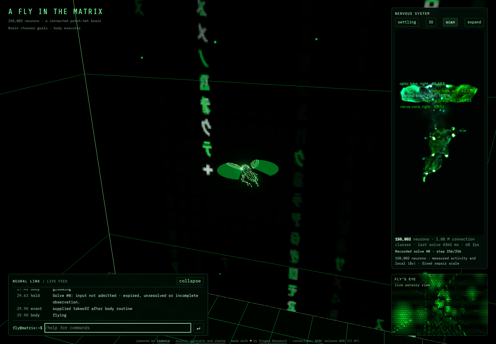

# A fly in the Matrix

**Import a biological connectome, get it running as a Cadence patch net, feed in
sensory data and read out neural decisions. That is the purpose of this example:
a practical working loop using the current library and its browser
implementation. It does not yet simulate every neural or bodily detail, such as
precise spike timing, the complete neurotransmitter and receptor system,
biological hunger regulation or individual muscle dynamics. The demo will
develop further as Cadence gains capabilities and the model gains better
biological data and validated sensory and body interfaces.**

The page runs the **full retained BANC connectome**: 150,802 neurons and
1,877,099 directed edge classes. Engineered sensory inputs drive its recurrent
patch net. Each neuron reads its incoming connections and repairs its local
state; the solver checks the entire network's equation residual before accepting
its outputs. Rendered eye pixels enter retained photoreceptors, and local
KC→MBON synaptic updates can change later responses.

**Brain chooses goals · body executes.** The full brain compares banana and
bread odor contexts, then supplies an approach/avoid choice. A supplied body
controller turns that selected goal into navigation, landing and stabilizing
wing commands. The body does not select a fruit by strongest odor or invent a
random target. Its route execution is engineered; the brain has not learned the
whole flight path, body mechanics or grooming.

The body launches once along its initial heading while the first neural choice
settles, then continues cruising with mechanical wall clearance between goals.
This supplied movement chooses no fruit and earns no learning credit.
The scan streams actual intermediate repairs while the worker computes.
The console shows the actual banana/bread odds: default sugar on banana
is an outcome to discover, not an initial banana preference.

**[How the patch-net brain works](docs/FLY_MATRIX_BRAIN)** explains the measured
connectome compilation, sensory inputs, mushroom-body learning and body control
in a short tutorial with a flow diagram.

Computation and the anatomical viewer now include the same **150,802 retained neurons**.
The full export bypasses recruitment and includes every retained fixture edge;
the importer's proofread-cell and contact-count filters still apply.
Attitude, rotation, airspeed, analytic odor, taste and contact enter named populations.
HS/VS and ocellar inputs use supplied projections, bypassing upstream visual processing.
The eye camera supplies pixels to all 1,831 retained photoreceptors, even with
the inset hidden. Their pixel mapping is an engineered index-grid because anatomical
viewing directions are unavailable. This establishes an input path, not recovered
biological retinotopy or trained visual navigation. Full motor coverage and
autonomous connectome flight remain unestablished.

Only qualified odor comparisons and free/positive/negative action phases can
supply a new neural goal. The body must actually use the matched choice before
its outcome can teach the actor; accepting a reply alone earns no credit.
The page has one controller. The separate `NeuralLife` module and its tests
retain the direct motor-readout experiment for development; visitors do not
choose a controller mode.

This observer-like system has bounded neural state, named sensory/motor boundaries,
settlement readback, action/outcome feedback and reproducible evidence. The
learner uses local KC→MBON phase contrasts with a supplied action sampler and external
actor-critic helper. It does not establish the final all-patch learner or an exact-gradient
theorem for a directed graph. Sensor, decoder and stabilizer parameters are supplied
candidates, not an evolved solution.

Historical learning, controller and ethogram receipts below use their recorded
graph and source revision. The image below records the goal controller with
the retained scan, eye and console interface. New release checks are listed
under [Run](#run); historical receipts are not tests of the current page.



Live page: [floatingpragma.io/cadence-examples/fly-matrix](https://floatingpragma.io/cadence-examples/fly-matrix/).
The same page runs from this directory; see [Run](#run).

## Run

The 0.17.0 release checks include [local rendering and startup](receipts/release_0_17_local_performance.json)
and [neural choice, physical outcome and local learning](receipts/release_0_17_local_learning.json).
On the tested Apple M4/Chromium setup, the 35-second rendering window averaged
60 FPS at 1× time, with a 0.30 m/s median moving speed. The separate learning check
observed feeding, landing and grooming after moving sugar to bread through the
ordinary console. It witnessed a nonzero matched synaptic update. These checks
validate the specified integration; they do not establish reliable innate food
seeking, biological completeness or performance on every device.


```bash
python3 -m http.server 8813 --directory web
# Open http://127.0.0.1:8813/
```

The page loads `web/data/brain_full.json` and `lessons_full.json`. The 42.9 MB
payload includes identity member indices and recalibrated full-graph output biases.
The old `brain.json`, `lessons.json` and their assays remain unchanged for
historical reproduction; their results are not transferred to the full graph.
The [brain guide](docs/FLY_MATRIX_BRAIN) explains how the model runs.
The [full-export receipt](receipts/full_export_integrity.json) records source
hashes and coverage checks; [the exporter](tools/export_web.py) provides the build options.

The page opens with the scene, a narrow nervous-system scan, a Matrix-style
command console and the fly's eye.
Type **`/help`** for commands and **`/status`** for a current brain/body snapshot.
The console keeps the latest 160 entries from real solve replies, sampled odor
choices, enacted choices, learning updates and body events. It reports
input IDs and distinguishes admitted input from actual movement. Collapse hides
only the log; ↑/↓ recalls commands and Tab completes them.
Drag the console's top edge to resize it; the height is remembered.
Double-click that edge to restore the default height.

Use `/brain settling`, `/brain 3d` or `/brain scan` to inspect the full brain;
`/brain off` closes that viewer while computation continues. `/paths` and `/senses`
open the path or sensory/motor panel. `/about` shows model details and `/close`
restores the default scan. `/brain` also defaults to the scan. Only one detail
panel opens at a time. `/reset` restarts
the brain and body; `/clear` clears the log and keeps command history.

The default eye inset renders the head-camera projection at 192×96 with cosmetic
facets. Actual neural input remains raw 64×32 captures from that projection.
Click the inset or use `/eye full` to enlarge it; `/eye on` restores it and
`/eye off` hides it without changing retinal input. Scroll over the main scene
to zoom the body, or choose `/camera follow` or `/camera room`.

Time starts at **1×**, targeting real-time pacing. Use `/speed 0.25`, `/speed 0.5`
or `/speed 1` to choose the rate. Body physics uses fixed `0.0005`-second steps
and carries fractional frame time; long stalls catch up at most one wall second.
Paused and hidden-tab time does not accumulate a backlog. Achieved pacing still
depends on hardware and rendering. The neural residual threshold remains `1e-6`;
a clock setting does not make an unqualified result authoritative. The live demo
limits each attempt to 256 rounds so a failing input does not monopolize the
worker; offline checks can use the engine's larger 1024-round ceiling.

`/status` prints command-time readings: supplied hunger, all-neuron activity at
`≥0.5`, actual settling iterations, initial/final equation mismatch and accepted
learning updates. Its connection count means weights differing from initialization;
learning events separately count connections moved in that update. Stale readings are unavailable; paused readings are marked
recorded. These printed lines remain history. The settling inspector's capture
can be older than a status snapshot. The experimental neural-course controller
also reports input age and its supplied motion adapter's execution phase.
`/gust` and `/nudge` apply physical
disturbances; `/pause` and `/resume` control time. `/sugar banana`, `/sugar bread`
or `/sugar none` changes the reward location.

The historical [scan and motion check](receipts/browser_scan_motion_final_2026-09-27.json)
matches displayed iterations, activity, potential changes and renderer inputs
to actual worker packets, and checks desktop/mobile access. Its steady window
recorded **0.300 m/s median speed** and **1.37 m net travel** over 8.22 simulated
seconds. All motion-support steps used delayed checked input or held continuation;
there were **zero fresh neural actuation steps** in that window. This verifies
the earlier neural-course motion adapter and recorded display, not the new
goal controller, learned flight or food finding.
The [mobile screenshot](receipts/browser_scan_motion_final_mobile_2026-09-27.png)
shows the same scan, eye and console layout on a narrow screen.

To repeat that source-bound check, serve its recorded revision with Playwright
installed. Always write new output files:

```bash
python tools/check_scan_motion.py --url http://127.0.0.1:8813/ --receipt receipts/scan_motion_new.json --screenshot receipts/scan_motion_new.png --mobile-screenshot receipts/scan_motion_mobile_new.png
```

The historical [console browser check](receipts/browser_brain_console_2026-09-27.json) passed
five groups with no page errors. It matches logged settlements, attention and
enacted courses to actual worker packets and physical-step counters; checks
command-time status, retinal input with the eye hidden, scene zoom and commands;
and verifies desktop/mobile access and reset. It did not induce a learning update.
This validates the interface and observed control events, not navigation competence.
Its source pins precede the scan replay and motion adapter. To reproduce that
interface, serve its recorded revision with Playwright installed and write new files:

```bash
python tools/check_brain_console.py --url http://127.0.0.1:8813/ --receipt receipts/console_new.json --screenshot receipts/console_new.png --mobile-screenshot receipts/console_mobile_new.png
```

The historical [flight and layout check](receipts/flight_clarity_course_camera_2026-09-27.json)
records 8.26 cm of net travel in 8.07 wall seconds, with a median nose/travel
angle of 0.62°. This software-rendered Chromium run used the default ½× setting;
actual simulation advanced at 0.378× under rendering load. It checks fresh motor
observations, enacted movement, hidden-view retinal input, optional panels,
pause/reset and the interface before the console redesign. Reproduce against its
recorded source revision into new output files with
`python tools/check_flight_clarity.py --url http://127.0.0.1:8813/ --receipt receipts/flight_clarity_new.json --screenshot receipts/flight_clarity_new.png --mobile-screenshot receipts/flight_clarity_mobile_new.png`.
Experimental neural-course regressions run with `node tests/neural-life.mjs`,
`node tests/neural-facing.mjs` and `node tests/neural-motion-support.mjs`.

The earlier [public state-display check](receipts/browser_public_states_complete.json.gz)
matches the cards to real worker results, checks stale-reply rejection after a
gust, and records a real nudge credited to an executed neural choice. It also
checks movement, removed controller/pose shortcuts, pause/reset and desktop/mobile
controls before the compact-panel and physics-clock changes. Reproduce against
its recorded source revision with
`python tools/check_public_states.py --url http://127.0.0.1:8813/` in an environment
with Playwright installed. The receipt is compressed JSON.

Type **`/paths`** to inspect choices and measured body positions. Goal-directed
travel is the supplied body's execution of the chosen intent, not a trajectory
planned by the neural model. In historical runs of the separate `NeuralLife` module,
the cyan measured trail and gold dashed
projection of the fresh neural turn/speed/climb request **before cruise and
smoothing** appear in a top-view map with a centimetre scale. The projection
holds that request for at most one simulated second; it is not a planned route.
Grey includes supplied continuation and other movement intervals.
The panel shows odor scores, probabilities and random
draws, explicitly labelling near ties. Pause withdraws the guide; reset clears the
trail. The annotations stay outside the fly's retinal input. Use `?paths=1` to
start with this panel open.

The default anatomical scan replays up to **seven full-population frames** from
each displayed sensory solve: initial activity, early iterations and final state.
Brightness shows actual last-step potential changes on one fixed relative
logarithmic scale for that recording. Each frame names its recorded solve and
iteration; no schematic travelling particles are added. Playback finishes one
recording before taking another and skips new recordings while busy. It neither
changes controller values nor runs extra solves. Float32 display copies preserve
the solver's Float64 computation. Run `node tests/neural-replay.mjs --payload`
to check exact numerical isolation, frame values, mapping and buffer ownership.

Type **`/brain settling`** for the detailed replay: captured eye
pixels, receptor and output activity, local equation patches, shared input ports,
actual potential repairs, and local/full-brain residual curves. The drawing is
a focused sample; every retained neuron contributes to the global check. Use
the timeline and patch selector to inspect a repair. **3D** and **scan** retain
the anatomical view of all retained neurons. Click **expand** to put input and
global settling beside the local neighborhoods on a wide screen. A selected
retinal input shows the exact encoded level, held drive and neural activity.
Detailed equations and output-cell tables open below the main display.
Trace capture runs only while this inspector is open; normal brain computation
and retinal capture continue when it is closed.

**Pause + compare pixels** runs an isolated actual-pixels/black-pixels pair from
the same state. **Final pixel difference** colors measured downstream changes;
its brightness uses a labelled relative scale. The worker restores its state,
and the comparison cannot steer or train the fly. Press Space afterward to
resume flight. The [brain guide](docs/FLY_MATRIX_BRAIN) explains the overlap and
repair meanings for this compiler.

The [full-graph trace check](receipts/settlement_trace_public_states.json) independently
recomputes every neuron equation at recorded checkpoints and checks the local
updates. Tracing preserves the solver state, learning state and next action draw
exactly. It also verifies pixel transduction and restoration after the isolated
comparison. Run `node tests/settlement-trace.mjs` and
`node tests/settlement-trace-worker.mjs --payload` from this directory.
The state observer's identity, freshness and initial-mismatch checks run with
`node tests/neural-state.mjs`.

The recorded [settlement-view browser check](receipts/browser_settlement_view_layout_verified.json.gz)
matches displayed pixels, receptor levels, connections and repair values to
actual worker messages. It also checks isolated comparison, resumed control,
timeout handling, reset and the expanded layout before the public controls were
simplified. The receipt is compressed JSON. Reproduce using its recorded source
revision, while serving that page, with
`python tools/check_settlement_view.py --url http://127.0.0.1:8813/` in an
environment with Playwright installed.

The [path-view check](receipts/browser_neural_paths_verified.json) compares the
display with actual body samples and accepted worker messages, checks the
projection independently, and verifies pause, the former brain-off comparison
and reset. A bright annotation is invisible to the retinal capture but visible when moved outside
the exclusion group. This checks display fidelity, not navigation competence.
Run `node tests/path-history.mjs` for the recorder and projection checks. To
reproduce the historical browser check, serve its recorded source revision and
run `python tools/check_neural_paths.py --url http://127.0.0.1:8813/` with
Playwright installed; its comparison controls are absent from the current page.

## Brain-selected goals

The default [goal controller](web/goal-life.js) gives the brain the food choice
and gives the body a declared way to carry it out:

| Decision or behavior | Source |
| --- | --- |
| Banana versus bread | Settled MBON scores from both odor contexts, with a supplied sampler |
| Approach versus avoid | The selected context's checked neural action; free and both nudged phases must qualify |
| Route, landing and balance | Supplied geometric goal tracking and wing stabilization; approach follows the chosen fruit, while avoidance executes a bounded retreat |
| Feeding, grooming and takeoff | Supplied contact/body routines: rest, feed when on sugar and hungry, head/leg/wing grooming, then takeoff |
| Learning | Local KC→MBON updates from a matched action that the body actually applied and its later outcome |

Without an admitted choice, the body cruises along its current heading, with
supplied room-clearance turns and no food selection or learning credit.
A nudge releases its perch and lets the real impulse act before stabilization
resumes. Goal tracking uses a supplied
`0.3 m/s` speed and room-clearance bounds. Its 20-second travel budget begins
after admission, separately from the neural reply deadline. An accepted goal can outlast a sensory
refresh; that is body execution of a recorded choice, not fresh neural steering
at every step. Fresh checked motor outputs can add bounded wing trim. Neither
the geometric route nor the fixed body routines are learned behaviors.
The [controller tests](tests/goal-life.mjs) use explicit synthetic qualified
choices to check those authority boundaries and actual body integration; they
do not establish natural connectome navigation or learning performance.

A separate [full-graph learning check](receipts/goal_learning_causal_2026-09-27.json)
applies **one synthetic rewarded lesson** under a fixed declared input. The same
input's approach probability changes from **47.39% to 71.09%**. Restoring the
original weights recovers the original neural state exactly; reinstating the
learned weights recovers the changed state exactly. Independent calculations
check every phase's residual and every plastic efficacy update. This establishes
a causal synaptic effect on settled responses, not multi-trial improvement or
learned navigation. Reproduce it with
`node tools/check_goal_learning.mjs --receipt receipts/goal_learning_new.json`;
the [producer](tools/check_goal_learning.mjs) refuses to overwrite a receipt.

The [paired food check](receipts/food_learning_paired_2026-09-27.json) tests actual
near-food sensory encodings with one explicit synthetic reward per food and
matched frozen-weight controls. Banana reward increases banana approach by
12.79 percentage points and bread approach by 1.36; bread reward increases
bread approach by 3.41 points and banana approach by 0.71. Frozen controls
preserve the original weights and responses exactly. This demonstrates local
odor selectivity with some generalization. Distant target odds remain near
50/50; reliable room-wide food preference is not established. These isolated
probes omit retina and use the offline 1,024-round budget. Reproduce with
`node tools/check_food_learning.mjs --receipt receipts/food_learning_new.json`.

An earlier [natural browser run](receipts/browser_neural_goal_recovery_2026-09-27.json)
records three qualified neural choices, two landings on the selected bread,
head grooming and takeoff before the latest physiology/budget fixes. It uses the actual full-connectome worker and
unmodified initial scene. The target scores were near ties; the choices do not
show a strong learned preference. Bread had no sugar, so those outcomes moved
no weights. Some contact-related sensory solves reached their cap; failed
attempts retain their real diagnostics and restore the previous neural state.
This run checks the decision-to-body link, not learned navigation.

The [earlier rewarded browser check](receipts/browser_goal_responsive_learning_2026-09-27.json)
uses the normal `/sugar bread` command, then observes an actual checked neural
approach, landing, feeding, grooming and takeoff. Its matched reward produced
1,246 nonzero synaptic efficacy changes; 16 exceeded the separate `1e-9`
changed-from-initial threshold. Target choice was initially a near tie. This
checks a working learning interaction, not a learned food preference across trials.

The [earlier 60-second hardware performance check](receipts/browser_goal_responsive_performance_2026-09-27.json)
measured **60.01 FPS**, **17.4 ms p95 frame time**, normal **0.30 m/s** travel,
and a simulation/wall-time ratio of **1.00021** on an Apple M4 using ANGLE Metal,
Chromium and a 1440×1000 viewport. The full brain, scan and eye remained active. Three neural choices were
admitted and executed during that default-scene window, including approach
and avoidance; four were requested, with one rejected.
The [mobile capture](receipts/browser_goal_responsive_learning_mobile_2026-09-27.png)
checks the compact layout; mobile hardware FPS and other devices were not measured.
Software-rendered diagnostic runs are substantially slower.

Reproduce with Playwright installed:

```bash
python tools/check_hybrid_restore.py --hardware --sugar bread --receipt receipts/new_learning.json --screenshot receipts/new_learning.png --mobile receipts/new_learning_mobile.png
python tools/check_goal_performance.py --receipt receipts/new_performance.json --screenshot receipts/new_performance.png
node tests/goal-physiology.mjs
```

The [physiology checks](tests/goal-physiology.mjs) cover bounded hunger, satiety,
food-contact loss, sugar removal, repeated food choices, reward identity,
head/leg/wing grooming and pause/reset. The browser checks preserve failed
settlements and use no injected pose, fabricated readout or manufactured reward.

## Historical hybrid model card

- **Name:** A fly in the Matrix
- **Author:** Bernhard Mueller
- **Description:** The earlier hybrid demonstration combined a measured-connectome subnet with scripted instincts and a hand-written flight pilot. Its sources and receipts are retained; its whole-atlas visualization was not whole-connectome control.
- **Cadence version:** 0.17.0 for the current release checks. Earlier contributions from this example include: in 0.15.0 the efficacy cap as configuration, the critic on the raw error under centring, the saturation and trace readings of the learn report and the viewer's anatomical mode with its palette, label and pixel-ratio options; in 0.16.0 the `specific` fact a cell class's gain is selected on, `calibrate_bias`, `naive_efficacy`, `preflight` and `seam_report`. The receipts name the version their numbers were produced with.
- **Hardware for initial training:** CPU only, one Apple M4 laptop. The whole nervous system settles at about 4 ms per step; the physiology gates take minutes; the learning campaign (`tools/campaign_odour.sh`) takes hours on the 12,000-neuron olfactory sub-net at about 0.3 to 1.5 s per batch decision, shared with other jobs. The BANC sources (about 440 MB) are not committed; the fixture's manifest with hashes is. See the [reproduction commands](#historical-reproduction-commands) for the explicit fetch/build procedure; `python -m fruitfly.banc` alone does not fetch missing raw files.
- **Cadence features showcased:** `cadence.Connectome` and `cadence.Brain` with `NeuronModel` on 150,802 neurons (the graded rate model at one global gain, `settle_batch` with masks for lesions and `Nudge` for the learning); `cadence.protocol` (rows, predicates, `select_gain`, `shuffled`) for the physiology gates, and the same selection for a gain per cell class (`Brain(log_gain=...)`) on the `specific` fact about the Kenyon cell code; `calibrate_bias` for the readouts' operating point, `naive_efficacy` for the plastic seam, `seam_report` for what custody left of it; `cadence.learning.Learner` with a plastic-synapse mask on the Kenyon-cell-to-MBON seam and `cadence.plasticity.ActorCritic` for the lessons; the atlas and `brain_scan.js` v4.1 in its anatomical mode; a browser twin of the settling engine, of the nudged phase and of the actor-critic, held to the library by parity tests.
- **Problems encountered during development:**
  - The earlier closed-loop setup did not damp pitch, and a hand-written stabilizer was added. That failure does not by itself establish its biological cause. Separate direct-control experiments removed the stabilizer.
  - The giant fibre's path to the jump muscles is electrical and absent from the chemical release, so those facts are not asked.
  - At the one global gain the antennal lobe ignites: 104 of its 425 local neurons are predicted cholinergic, they are the broad ones (a median of 88 projection-neuron targets each against 16 for the GABAergic), and they excite each other through 194,044 synapses, a loop that is supercritical at that gain. Any input lit the lobe into one state and 38 to 40 percent of the Kenyon cells answered every odour alike (cosine 0.98 between the codes of fruit and yeast at every gain; the animal's code is sparse and specific). Neuron adaptation did not sparsen it, and neither did a threshold (at a bias of -6 the local neurons stayed a third active): a loop needs a gain. The local neurons' gain is selected by protocol like the global one, on the facts that the Kenyon cell code is sparse and specific (`tools/class_gains.py`, `receipts/class_gains.json`); at a twentieth of their measured output the codes are 4 and 11 percent of the Kenyon cells with a cosine of 0.32.
  - The synapse floor of the fixture had cut the memory: a Kenyon cell makes a few synapses on each output neuron of its compartment, so a floor of five kept 231 of the 1,079 classes onto MBON11 right and 14 of the 336 onto MBON05 left, and nine blows moved the approach probability by 0.03. The fixture keeps the Kenyon-cell-to-MBON seam at every count (16,795 classes; `SEAMS` in `fruitfly/banc.py`).
  - A connectome carries no operating point: at the global threshold the approach cell sat at 1.00 under every odour and the avoidance cell at 0.01, where a nudge has no slope, and on the measured seam counts the naive fly avoided the fruit odour and approached the yeast (0.17 against 0.83) before any lesson, so the fruit was never approached and never rewarded. The lesson starts naive (every plastic class the same weight, `naive_efficacy`) and the two output cells are calibrated jointly over the situations the fly decides in, the approach cell to 0.6 and the avoidance cell to 0.4, the naive fly's attraction to food smells (`calibrate_bias`; `fruitfly/lessons.py`, `receipts/lessons_setup.json`; at one half each the naive fly made eleven fruitless searches before its first sugar on the page). With the three in place the T-maze reverses in both directions on the library's actor-critic (`tools/tmaze.py`): sugar at the fruit, blows there, sugar at the yeast ends at 0.17 for the fruit against 0.85 for the yeast; the same the other way round ends at 0.85 against 0.37.
  - Three traps of the readout were measured in pilots: at the worm's softmax temperature (0.05) two cells in [0, 1] make a certain choice and the nudge has nothing to push; balancing the pair at one half in an open field leaves a fly that avoids every smell and is never rewarded; and with approach paying half the time the rule first silences the avoidance cell for both smells before the value catches up. The arena is therefore the animal's T-maze, where avoiding one smell means taking the other.
  - A first design read the actions from descending neurons (DNa02 left and right, DNp09); inside the olfactory sub-net those neurons receive almost no lateralized odour input, so the wiring could not express a left-right policy. The actions are read from the mushroom body's own output neurons by Aso's transmitter rule.
- **Hosted at:** https://floatingpragma.io/cadence-examples/fly-matrix/
- **Receipts and checks:** `fruitfly/fixtures/banc_888_manifest.json` (custody, the seam kept at every count), `receipts/g2_reflex_facts.json` and `receipts/g2_reflex_loop.json` (the steering circuit), `receipts/g3_instinct_facts.json`, `receipts/class_gains.json` (the local neurons' gain by protocol, with shuffled controls), `receipts/lessons_setup.json` (the naive seam, the calibrated readouts and the library's `preflight` on the page's sub-net: no warnings before the first lesson), `receipts/g4_tmaze_reversal.json` (the T-maze reversal in both directions on the library's actor-critic, against a shuffled wiring), `receipts/page_reversal.json` (the visitor's reversal on the real page in a headless browser, three seeds in each direction), `receipts/subnet_closure.json`, `receipts/odour_code.json`, `receipts/g4_lessons.json` (the lessons against the controls), `receipts/g3b_ethogram.json`, `tests/parity.mjs` (the browser brain against the library, 4e-16), `tests/body.mjs` (the body's twins bit-identical over 71,000 steps), `tests/learner_smoke.mjs`. `node fly-matrix/tests/parity.mjs --legacy-subset && node fly-matrix/tests/body.mjs && node fly-matrix/tests/learner_smoke.mjs` from the repository root.
- **Data and rights:** BANC release 888 (the Lee lab and the BANC community, CC BY): `meta.feather`, `edgelist_simple_v3.feather`, `neurotransmitter_prediction_v2.csv` from the public bucket, pinned by SHA-256 in `fruitfly/banc.py`. The ethogram's reference numbers and their sources are in `docs/REAL_FLY.md`.
- **Work in progress:** the gate-4 receipt across seeds and controls; a parity test of the browser learner against the library's actor-critic on recorded decisions; the optic lobe as a sense.

Current planning and audit records live outside this public repository in the owning workspace.
The real animal's numbers and sources are in `docs/REAL_FLY.md`. Historical receipts remain in
`receipts/`; their source hashes and protocols govern their interpretation.

## Experimental neural-course controller

The separate [NeuralLife experiment](web/neural-life.js) remains in source and
controller tests; it is not a selectable mode on the demo page.
It reads the available command at every physics step.
[The decoder](web/neural-policy.js) maps descending-neuron activity
and wing-plane steering to turn, forward speed and vertical speed. The supplied
hover thrust amplifies neural wing-plane intent through an explicit mechanical
admittance. The page then opts into [motion support](web/motion-support.js):
**0.3 m/s** horizontal cruise in the requested direction, a **0.25-second**
velocity-target response and a **1 m/s²** target-change limit. These are supplied
mechanical settings, not brain-selected speed or calibrated fly physiology.
Fruit coordinates do not enter either decoder or motion adapter.

A checked observation must arrive before **four simulated seconds** of age.
The adapter can continue its direction for **eight simulated seconds after
receipt**, then smooth its target toward zero. Failed matching motor observations and hard
revocation clear stored motion. Raw wing trim and mouth extension retain a
**one-second** freshness window. Actual execution of a matched actor choice can
be recorded from fresh or delayed checked input under four seconds old; held
motion alone cannot create that record. A later real outcome within the original
15-second episode can reference the recorded execution even if the latest input
has expired. Failed matching inputs and hard revocation clear that evidence;
delayed execution never counts as fresh motor activity. The strict
controller's default remains unchanged when motion support is not enabled.

The supplied stabilizer turns the body's nose toward requested travel. A negative
forward command adds a half-turn to its facing target while preserving the signed
neural direction, yaw and vertical requests. The motion adapter smooths the
resulting world-velocity target. Physical wing torques produce the turn;
the renderer does not flip the fly. This is mechanical coordination, not a learned
orientation policy or evidence of biological navigation competence.

Before a food choice, the worker compares both odor candidates in the same
connected brain, from the same initial state and frozen sensory snapshot. A
supplied attention protocol masks the competing odor for each probe. Settled
MBON approach-minus-avoid scores determine the target probabilities. After
selection, the same circuit supplies an approach/avoid action and local learning
eligibility. Learning the chosen action can also change later target scores;
this is not an established target-policy gradient or proof of competent food finding.

The supplied target-choice budget is **10 simulated seconds**. A choice still
needs an actually applied, matched checked attended command before it is counted
as executed. A prior course can continue across the choice boundary without
being credited to the new choice. Raw motor authority expires after
**one simulated second**, with the same residual check.

[Retinal encoding](web/retina.js) uses actual head-camera RGB pixels, independently
of whether the eye inset is visible. Retinal and navigation gains are explicit
engineering candidates. Prior receipts below measure earlier controllers and do
not establish the new controller's behavioral performance.

The [retinal/target worker check](receipts/neural_worker_navigation_motor_assist.json) exercises
the full graph: changing test pixels affects downstream activity, cutting retinal
outgoing connections removes that effect, and restoring them recovers it. Both
odor comparisons and all three action phases qualify; a matching synthetic reward
changes local synapses. This is a causal wiring check, not a food-finding result.
[Controller tests](tests/neural-life.mjs) independently check route authority,
hidden-coordinate independence and withdrawal of expired commands.

Run these focused checks with `node tests/retina.mjs`,
`node tests/neural-life.mjs`, `node tests/neural-execution-credit.mjs`,
`node tests/worker-scheduling.mjs` and `node tests/neural-worker.mjs --payload`.
The execution-ledger checks are controller tests, not browser evidence of learned
navigation or a learned response to wall contact.

The historical [navigation page check](receipts/browser_neural_navigation_verified.json)
records actual rendered retinal packets, checked odor comparisons, a matching
executed choice and 7.2 cm of horizontal motion over about two simulated seconds.
Its former brain-off comparison retained a powered hover with no route or target. This run moved
backward; odor scores were effectively tied at the distant start. It validates
the control path, not reliable navigation to the selected fruit. Reproduce with
`python tools/check_neural_page.py --url http://127.0.0.1:8813/ --full` while serving
the receipt's recorded source revision, using an environment with Playwright installed.

The [hidden-view check](receipts/browser_neural_navigation_hidden_active_window.json)
confirms that retinal capture continues with the inset disabled. With
`--after-active`, it separately records a 1.542-second simulated startup delay,
then 9.55 cm of motion over two simulated seconds of neural control. The
[earlier startup-inclusive check](receipts/browser_neural_navigation_hidden_views.json)
missed its 5 cm motion gate because control began later; that result is retained.
These timings are software-rendering observations, not real-time performance claims.

## Previous assisted controller

The following contract and receipts describe `AssistedLife`, the earlier
trim-plus-scripted-navigation controller. The public page's goal controller
uses a different authority boundary: the brain selects the goal and intent,
and the supplied body executes them. Historical browser commands in this section
require their recorded page revision; the standalone tests remain separate.

`web/assisted-life.js` uses the supplied `Life` and `HandPilot`, with their assistance
listed in `authority`. Unchecked legacy descending-neuron, giant-fibre and feeding
readouts are disabled. The worker freezes the sensory snapshot and requires a potential
equation residual ≤1e-6 within 1024 iterations. Capped and nonfinite states cannot actuate.
The accepted motor-neuron decoder contributes wing-plane/shift trim only, limited to
±0.05 rad and ±0.05 mm per wing, expiring one simulated second after observation.
Wing amplitude and frequency remain pilot controlled. The limits are hand-set candidate
parameters; `tests/assisted-life.mjs` compares actual-payload motor output to a motor-output
lesion at identical body/pilot state, checking the resulting velocity and rotation.

An approach/avoid choice requires the free state **and both nudged states** to meet the
same residual threshold. Its request ID, controller generation, search token, deadline,
settled MBON probabilities and sampled action must agree. Accepting a proposal is
separate from using it in navigation. Only a used choice can receive a later matching
search outcome; chance landings and retrospective forced choices cannot train. Cancelled
proposals restore their eligibility. Malformed, stale, unaccepted and replayed reward
packets are rejected. Reward transduction also supplies named PAM/PPL1 inputs; it is
not inferred biological reinforcement physiology.

The assisted animation uses the historical capped visual clock; CPU and rendering load
can slow simulated time. Its one-second motor lifetime and three-second search timeout
are simulation time, not real-time control guarantees. Pilot-only fallback remains
visible whenever neural replies fail or expire.

```bash
node tests/assisted-life.mjs
node tests/settled-learning.mjs
node tests/assisted-worker.mjs --payload
node tools/assisted_evidence.mjs --help
```

The preserved **60,000-neuron subset assay** is separate from the animation and
does not measure the new full graph. It has no body or flight pilot:
[`assisted_evidence.json`](receipts/assisted_evidence.json) preserves the original 512-step
experiment; [`assisted_evidence_1024.json`](receipts/assisted_evidence_1024.json) records the
explicit follow-up with a larger numerical budget. In the follow-up, both initial odor
inputs produced distinct qualified outputs. The plastic arm qualified 16 of 24 trials;
the frozen actor qualified all 24. The learned yeast-approach probability changed from
0.7928 to 0.2457, and exact weight restoration/reinstatement removed/recovered that effect.
The final fruit probe failed the residual threshold, so complete two-odor learning is
not established. All failed trials and the original protocol remain in the journals.
These are one-seed causal diagnostics, not a generalization benchmark. Use the strict
verifier below: it checks the complete journal, derives the reported claims and can
replay every training and control trial. The frozen producers retain their earlier,
more limited checkpoint verifiers for provenance.

```bash
# Frozen subset tests use the receipt-pinned archived solver automatically.
node tests/assisted-evidence.mjs
# Direct verifier commands require the complete recorded source revision.
node tests/assisted-evidence.mjs --1024
node tests/assisted-evidence-verifier.mjs
# With Playwright Chromium installed and the local page served:
python tools/check_assisted_page.py --full --url http://127.0.0.1:8813/
python tools/check_assisted_lesson.py --url http://127.0.0.1:8813/
```

The earlier browser checks distinguished actual horizontal flight, neural motor trim,
pilot-only fallback, and one real decision/outcome/update cycle from a declared
near-food starting point. They used the 60,000-neuron graph and did not count assisted
landing or feeding as neural muscle control. Historical full-scene Chromium verification is recorded in
[`browser_assisted_documented.json`](receipts/browser_assisted_documented.json); this environment ran slower
than real time. The separate reduced-rendering lesson fixture is recorded in
[`browser_assisted_lesson_documented.json`](receipts/browser_assisted_lesson_documented.json).
“Full-scene” describes rendering, not full-connectome execution.

The new full-graph Node checks match six forty-step Python trajectories within
`3.33e−16`, demonstrate a motor-output lesion changing body motion at fixed pilot
state, and perform a qualified three-phase worker update changing 11,062 plastic
classes. These establish arithmetic and causal update paths, not transfer of the
subset's longer learning outcome.

The [full-connectome browser check](receipts/browser_assisted_full_connectome.json)
also passes motion, pause, brain-off and worker-failure checks with the complete
scene. The assisted fly moves 0.7051 m horizontally in 2.025 simulated seconds,
with 19 accepted neural observations and applied wing trim. Software rendering
takes 41.33 wall seconds for that interval. This checks working assisted motion,
not autonomous flight or learned navigation.

The separate [full-connectome browser lesson](receipts/browser_assisted_lesson_full_connectome.json)
records one sampled approach choice executed before sugar contact, followed by
exactly one matching local update moving 10,950 plastic classes. All three
neural phases satisfy residual ≤1e-6. The fixture starts near bread with a supplied
flight bout and assisted landing; this establishes the choice–outcome–update
path, not unaided food finding or the subset's measured post-learning response.

## Historical direct-control contract

This separate motor-only experiment remains in source and tests. It is not a
mode of the public page. Its browser reproduction requires the recorded page
revision with the corresponding controls.

`web/settled-life.js` observes the environment without selecting a behavior. `web/worker.js`
freezes that observation and calls `SettlingBrain.settleControl(256, 1e-6)`, which checks the
potential equation residual at the returned state. A validated reply passes named motor
activities to `settledMotor`. Physics advances independently at 0.5 ms fixed steps, including
while the worker is busy. Neural requests are spaced by at least 20 ms of simulated time,
with only one in flight. Delayed replies are validated after advancing the preceding physics
interval, so a newly received command cannot act retroactively. Computation is often too slow
for the command deadline; real-time neural control has not been demonstrated.
Request IDs, controller generations and a 120 ms simulation-time deadline reject stale
commands. Worker errors or a five-second wall timeout remove actuation. Reset starts a fresh
brain and body; switching away from a legacy mode cannot carry its learned state into direct
mode.

The full payload retains the supplied local-neuron gain and naive Kenyon-cell seam,
with MBON biases recalibrated on all retained neurons. It is not an untouched
anatomical measurement.

The pure Python twin is `fruitfly.settled_controller.SettledController`; motor transduction
lives in `fruitfly/motor.py` and `web/motor.js`. Power has no positive hover offset: amplitude is the square root of normalized power,
with the supplied 200 Hz carrier active only while at least one wing has positive power.
At zero steering this makes force proportional to activity, avoiding the previous quartic
suppression. This is a declared candidate actuator model, not fitted biological calibration. TTM motor
activity is exposed but supplies no leg force until a leg body is implemented. The wingbeat
carrier is supplied mechanics, not a demonstrated connectome-generated oscillation. Surface
contact models horizontal support tops, not solid object sides or articulated feet. Feeding
requires both physical sugar contact and MN9 drive; displayed mouth extension follows MN9.
In this separate direct-control comparison, the compound-eye rendering remains
a view; retinal input is connected in the current goal controller and neural-course experiment.

A small residual proves neither uniqueness nor global convergence. The chemical graph is
directed; reciprocal energy-model learning theorems do not automatically apply. Historical
subnet closure passed selected population averages but failed its member-level threshold;
complete motor coverage and behavioral equivalence between subset and full graph
remain unverified.

From this directory, using a Python environment with the sibling Cadence checkout installed:

```bash
python -m pytest -q tests/test_settled_controller.py
node tests/settled_motor.mjs
node tests/settlement.mjs --payload
node tests/settled-life.mjs
node tests/settled_body.mjs
node tests/physics-clock.mjs
node tests/camera.mjs
node tests/control-cache.mjs --payload
python tools/check_settled_page.py --full  # Playwright Chromium, full rendered demo
python3 -m http.server 8813 --directory web
```

The preserved `tools/settled_control_probe.mjs` uses the historical 60,000-neuron
payload and freezes physics during computation to measure the neural/body equations;
it is separate from both the full-graph page and its live asynchronous scheduler.
It records every scheduled solve
and both trajectories, including a motor-off arm, in the requested small receipt. The browser
test exercises the full atlas, close-up and eye view with continuous physics, delayed commands
and camera stability. The earlier subset outcome was insufficient power for flight and capped
solves during the fall. These failures are retained rather than covered by a fallback pilot.
The earlier direct-control receipts bind historical source bytes; verify a newly produced
receipt against the current source instead of rewriting an old receipt's hashes.

## Historical hybrid measurements

The following receipts predate exclusive motor authority and do not validate autonomous
connectome flight or complete control of the fly.


| Gate | Result | Receipt |
| --- | --- | --- |
| Custody | 150,802 proofread neurons (glia, trachea and non-neuronal objects excluded) of 188,508 objects; synapse classes at five or more synapses; signs from the presynaptic transmitter | `fruitfly/fixtures/banc_888_manifest.json` |
| The whole brain settles | one step of all 150,802 neurons costs about 4 ms on a laptop CPU; rest is an exact fixed point; activity stays below 1 percent under every stimulus up to a gain of 0.04 | `tools/reflex.py` |
| G1 body | the hand-flown body hovers to a micrometre, laps at 0.30 m/s, bursts to 0.91 m/s, saccades 90 degrees in 44 ms, tumbles open loop (90 degrees of tilt at 277 ms); Python and browser twins agree bit for bit over 71,000 steps | `tests/body.mjs` |
| G2 reflex facts | 7 of 13 held-out physiology facts about the wing steering circuit pass on the measured wiring at the gain two training facts select (haltere afferents onto b1; ocellar input onto a subset of the neck motor neurons); three shuffled wirings pass 3, 1 and 1 at their own gains | `receipts/g2_reflex_facts.json` |
| G2 closed loop | under the declared senses and muscles the measured wiring leaves roll and yaw damping intact where shuffled wirings spin the fly, and does not damp a pitch impulse; the reflex is supplied | `receipts/g2_reflex_loop.json` |
| G3 instinct facts | 8 of 14 held-out facts pass on the measured wiring (looming through LPLC2 and LC4 to the giant fibre, bitter suppression of the proboscis motor neuron, odour to a sparse set of descending neurons and to a sparse Kenyon cell code); each shuffled wiring passes 2 | `receipts/g3_instinct_facts.json` |
| Sub-net comparison | A historical twelve-stimulus, sixty-iteration comparison put selected population means within 1e-3 of the full retained model. It does not establish equivalence of the current calibrated, learning-enabled model or the irrelevance of omitted neurons. | `receipts/subnet_closure.json` |
| Browser engine | the browser brain reproduces the library's settling to a relative difference of 4e-16 over six stimuli | `tests/parity.mjs` |
| Odour code | in the rate model the antennal lobe is bistable: below a receptor level near 0.15 nothing reaches the Kenyon cells, above it the lobe ignites through its cholinergic local neurons and 22 to 57 percent of the Kenyon cells answer, almost all of them to every odour (cosine 0.98 between the fruit and yeast codes at every gain); the odour identity survives as a graded difference on about 180 Kenyon cells and as a naive preference of MBON05 | `receipts/odour_code.json` |
| G4 lessons | which odour means sugar, by the library's actor-critic on the Kenyon-cell-to-MBON synapses: with the local neurons' gain, the seam started naive and the readouts calibrated, the T-maze reverses in both directions (sugar at one odour, blows there while the sugar moves, the other odour found: 0.17 against 0.85 one way, 0.85 against 0.37 the other) and a shuffled wiring learns nothing (`tools/tmaze.py`); the longer arena campaign against shuffled, frozen and MLP controls is `tools/campaign_odour.sh`; on the page (`tools/reversal_scenario.py`, three seeds in each direction) banana-first reversed in two seeds of three (the bread's sugar after 4 and 5 blows, 252 and 245 s after the switch) and in the third only after the check's 900 s limit, bread-first in one of three (fed at 182 s, the banana's sugar after 3 blows and 18 s); in the other two the fly never landed on the bread in the 600 s with the sugar there | `receipts/g4_tmaze_reversal.json`, `receipts/page_reversal.json`, `receipts/g4_lessons.json` |
| G3b ethogram | 240 s on the page under each setting of the switch, seed 7, from a fresh page after ten seconds (`tools/ethogram.py`, headless on SwiftShader): the measured wiring flies bouts of 14 s with 0.45 saccades per second of flight, sits 7.6 s at a time and 0.35 of the time, lands 11 times and decides on an odour 3 times; the shuffled wiring lands 17 times, sits 3.6 s at a time and 0.26 of the time and decides 13 times; the instincts alone sit 0.83 of the time in flights of 1.9 s, most of them hops of under a second onto the bread; saccade rate, sit length and sitting fraction inside the bands of `docs/REAL_FLY.md`, the flight bouts under the wind tunnel's 30 to 90 s | `receipts/g3b_ethogram.json` |

## Layout

- `fruitfly/banc.py` custody of the release (pinned sources, the fixture, the manifest)
- `fruitfly/brain.py` the connectome as `cadence.Connectome` with the flight, instinct and mushroom-body populations named (MBONs by type, side and Aso's valence rule), and `cadence.Brain` on it
- `fruitfly/protocol.py`, `fruitfly/instincts.py` gates 2 and 3: the physiology facts, with sources
- `fruitfly/senses.py`, `fruitfly/motor.py` the declared dictionaries between the room and the afferents, and between the motor neurons and the wing controls
- `tools/export_web.py` full retained-connectome export by default; `fruitfly/subnet.py` is the explicit historical recruitment alternative
- `fruitfly/body.py` the flight physics and the hand pilot (Python reference); `web/body.js` its twin
- `fruitfly/arena.py` the T-maze (and the open-field and steering tasks, kept for the record); `tools/learn_odour.py` the trainer; `tools/odour_code.py` the Kenyon cell code scan; `tools/export_learned.py` the checkpoint onto the page's sub-net and the page's constants; `tools/lessons_receipt.py` the gate-4 table; `tools/ethogram.py` gate 3b on the page
- `tools/` the other exports and experiments; `tests/` parity, invariants and the learner's smoke test
- `web/goal-life.js` the goal-execution controller; `web/neural-life.js`, `web/neural-policy.js` the experimental neural-course controller and declared output decoders; `web/assisted-life.js` the checked observation/choice base and earlier controller; `web/settled-life.js` the separate motor-only experiment; `web/life.js` supplied senses/outcomes and historical behavior routines
- `web/` the page: `index.html`, `page.js`, `worker.js`, `brain.js` (the settling engine with nudged phases), `learner.js` (the actor-critic), `senses.js`, `motor.js`, `body.js`, `room.js`, `fly.js`, `eye.js` and `retina.js` (pixel capture and input encoding), `brain_scan.js` (the anatomical viewer), `settlement-view.js` (recorded repairs and pixel comparison), and `path-view.js` (measured positions and current command guide)
- `web/data/atlas.json` every retained neuron at its position; `brain_full.json` and `lessons_full.json` the current full-graph model/setup; `brain.json`, `lessons.json` and `learned.json` the historical subset artifacts

## Historical hybrid claim boundary

Supplied: the wiring and its signs; which afferents sense what and at what level; which
descending and motor neurons command what and by how much; the body's aerodynamics and its
wingbeat-timescale stabiliser; the room; the hand-written instinct layer (bouts, saccades and
their fidgets at the animal's rates, landings, sitting, grooming) that the brain overrides; the
turn toward or away from a smell once the mushroom body has chosen; the valence assignment of
the two output neurons; a declared tonic drive on the avoidance cell where the receipt says so.
Measured: whether the wiring, under those declarations, does what the physiology reports and
what the life needs, against a shuffled wiring and against the hand-written layer alone; and
whether the lessons change the choice, against the controls. The odour channel's member-level
closure and the ignition of the antennal lobe are the model's known limits and are reported as
measured.

## Historical reproduction commands

These tools and their original receipts evaluate the legacy hybrid, not the current goal
controller. Large raw data (including the roughly 440 MB BANC release) belongs on a remote
compute host; do not fetch it onto a constrained local machine merely to run the page.
Use the recorded source/payload revision for historical browser reproduction;
the public page no longer has legacy or comparison modes. The commands below
show those historical scenario interfaces and the explicitly selected subset export.

```bash
PY=/Users/muellerberndt/Projects/oph-meta/cadence/.venv/bin/python
$PY -c 'from fruitfly.banc import fetch_sources, build_fixture; fetch_sources(); build_fixture()'  # on the data host
$PY tools/reflex.py                  # gate 2 facts
$PY tools/reflex_loop.py             # gate 2 closed loop
$PY tools/instincts.py               # gate 3 facts
$PY tools/class_gains.py             # the local neurons' gain by protocol, with shuffled controls
$PY tools/tmaze.py                   # the T-maze reversal both ways on the lesson's setup, with a shuffled control
$PY tools/export_web.py --budget 60000 --hops 3 --min-count 6 --output-dir /tmp/fly-subset-rebuild  # isolated historical procedure
node tests/parity.mjs --legacy-subset  # checked-in historical payload/reference
$PY tools/subnet_closure.py
$PY tools/export_atlas.py            # every neuron at its position, for the page
node tests/body.mjs                  # the body's parity and invariants
node tests/learner_smoke.mjs         # the browser learner on the page's payload
node tests/life.mjs                  # the fly's life: fruits the visitor moves, one decision per search, outcomes
$PY tools/reversal_scenario.py --legacy --receipt runs/reversal_legacy_rerun.json  # the visitor's reversal on the real page in a headless browser (10 to 20 min)
$PY tools/odour_code.py              # the Kenyon cell code across gain and level
python3 -m http.server 8813 --directory web   # then open http://127.0.0.1:8813/
GAIN=0.02 TEMP=0.3 CAP=3 BALANCE=1 ./tools/campaign_odour.sh   # gate 4, hours; then:
$PY tools/lessons_receipt.py && $PY tools/export_learned.py runs/learn_odour/connectome_s0.npz
$PY tools/ethogram.py --legacy --receipt runs/ethogram_legacy_rerun.json --seconds 240  # gate 3b, with the page served
```
