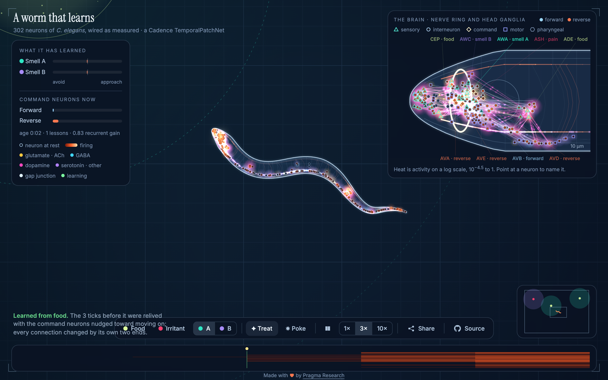

# The worm

The nervous system of the hermaphrodite *C. elegans*, 302 neurons wired as measured, as one
Cadence `TemporalPatchNet`. It lives on a plate, smells, eats, gets hurt, and learns during its
life what the smells around it predict. The page draws the whole nervous system inside the
transparent body at every zoom, in two tones. Structure is cold: the body, the cords, the wiring
and every neuron at rest are pale blue on navy. Activity is hot: a firing neuron glows from deep
red through orange to white, each synapse releases pulses in its transmitter's colour, and the
nerve cords heat up where the cells along them fire. Around each cell lies a cloud of the
transmitter it is receiving most of, welling up as it is released and draining slowly, so food
floods the head with dopamine. A lesson is the one green: the connections
that changed, then a ring arriving at each cell hop by hop from the command neurons. A second
view shows the head at scale, straightened: the nerve ring, the ganglia around it, the
sensory and command neurons by name, and what each cell is by the tint and shape of its patch
(sensory, interneuron, command, motor, pharyngeal). Heat follows the logarithm of activity, because a signal
fades by orders of magnitude as it spreads.

[](https://floatingpragma.io/cadence-examples/celegans/)

Live page: [floatingpragma.io/cadence-examples/celegans](https://floatingpragma.io/cadence-examples/celegans/).
The same page runs from this directory; see [Run it locally](#run-it-locally).

## Card

- **Name:** The worm
- **Author:** Bernhard Mueller
- **Description:** The 302 neurons of the hermaphrodite *C. elegans*, wired as measured, as one temporal patch. The worm lives on a plate, smells, eats, gets hurt, and learns during its life what the smells around it predict. The page draws the whole nervous system inside the crawling body.
- **Cadence version:** 0.12.0. The newborn brain in `web/data/brain.json` is exported under that release, and CI rebuilds it under the same pin.
- **Hardware for initial training:** None. The twelve reflex lessons before birth run inside `worm/tools/export_web.py`, 41 seconds on an Apple M4 laptop, CPU only. Everything else is learned in the browser while the worm lives.
- **Cadence features showcased:** `cadence.experimental.PartitionedTemporalPatchNet` with the connectome as its mask; `imagine`, `advance` and `observe` used as the library documents them; learning by centred equilibrium detuning with backtracking; `set_parameters` and `growth` for the stability bound on every lesson; a browser port of the same energy solve, held to the library by a parity test.
- **Problems encountered during development:**
  - The first body rewound a trail of past head positions when reversing. Repeated reversals in an irritant field used the trail up and the worm shrank to a point, and omega turns and wall bounces turned the head in one step and folded the body. The body is a centreline of exactly one body length whose leading end bends at a bounded curvature, and a turn rotates the direction of travel directly.
  - The same seed leads a different life on another machine, because the last digit of a float changes a decision. The CI runner's life found a wall-clamp kink that never occurred locally. Coverage therefore rests on a brain-free fuzz of 300 bodies that is identical on every machine, and the wall rule turns an end inward before it reaches the edge.
  - Float exports differ between the Linux runner and a Mac at 1e-12, so a byte-for-byte gate on `brain.json` failed. `check_exports.py` compares exactly where nothing is rounded and to 1e-6 elsewhere.
  - The network has no spontaneous activity. Away from every smell it goes cold, and the page shows that instead of adding noise.
  - The committed export carried the version string of an earlier release while CI rebuilt under the pin, and the export check compares that string exactly. The export was rebuilt under 0.12.0.
  - A 1.7 MB social card made X fall back to a card without an image. The card is a 1200 by 630 JPEG of about 100 kB.
- **Hosted at:** https://floatingpragma.io/cadence-examples/celegans/
- **Receipts and checks:** `tests/parity.mjs` (the browser brain against the library, worst relative difference 8.5e-12), `tests/body.mjs` (the body's invariants under stress), `tools/check_exports.py` (the committed exports against a rebuild). `node worm/tests/parity.mjs && node worm/tests/body.mjs` from the repository root.
- **Data and rights:** The connectome and the cell classes come from openworm's c302 and ConnectomeToolbox (MIT); the soma positions from Kaiser and Hilgetag (2006). Sources, hashes and citations are in `data/SOURCES.md`.
- **Work in progress:** a conditioning receipt with paired, unpaired, frozen and lesioned controls across seeds; a body the motor neurons drive.

## What this example shows

- **Learning from experience in one life.** Apart from twelve reflex lessons before birth, nothing is trained in advance. What a smell means is learned from the food or the pain it came before, while the worm lives on the plate.
- **Simple affect.** Food and pain are the only outcomes. They decide when a lesson happens and which command group it favours; bacteria reach the dopaminergic neurons and pain the ASH nociceptors.
- **Direct motor control.** The body reads the command interneurons and nothing else. No controller sits between the brain and the movement.
- **Structure as a constraint.** The measured connectome is the mask of one `PartitionedTemporalPatchNet`. Learning changes the weight of a connection that exists and cannot add one.
- **The temporal patch used as documented.** `imagine`, `advance` and `observe`, learning by centred equilibrium detuning with backtracking, and a stability bound on every lesson.

## The brain is the connectome

- Neurons: the 302 of `data/c302_A_Full.net.nml`, placed at their measured soma positions
  (`data/SOURCES.md`).
- Connections: `cadence.experimental.PartitionedTemporalPatchNet` with the connectome as its
  mask. Each chemical synapse class and each gap junction is one permitted entry of the context
  matrix `A`; nothing else can grow. At birth an entry is `sign · log(1 + count)`, with the sign
  from the transmitter (GABA inhibits), gap junctions symmetric, and `A` scaled to spectral
  radius 0.5.
- Senses (`B`): smell A on AWA, smell B on AWC, bacteria on the dopaminergic CEP, ADE and PDE,
  pain on the ASH nociceptors.
- Readouts (`C`): the command interneurons. AVB and PVC drive the body forward; AVA, AVD and
  AVE drive it backward. `C` averages each group and is fixed.
- Behaviour: when backward drive wins, the worm reverses and then makes an omega turn (a
  pirouette). It does so more often while forward drive falls, and it bends toward the side of
  its head swing on which forward drive rose, so smells steer it only through what the brain
  makes of them.
- Body: a centreline of exactly one body length. Whichever end leads lays the track and the
  rest of the body follows it: the head when crawling, the tail when reversing. The leading end
  can only change direction at a bounded curvature (10 rad/mm, a 0.1 mm radius), so an omega
  turn is a curl of the head that the body follows through, mostly toward the ventral side.
  Near the plate's edge either end must head inward, the more so the nearer the edge, so the
  edge is met with a turn, not a bounce; a nose that reaches it all the same backs off. The body wave advances with distance
  travelled (one wave per 0.7 mm). The motor neurons are part of the brain and carry activity,
  but nothing in the body reads them: the body reads the command interneurons only, and the
  wave and the manoeuvres are the body's own.

## How it learns, by the letter

The brain is used exactly as the library documents it:

1. Every tick, `sense` appends what the sensory neurons receive to the stretch not yet
   committed and `imagine`s the stretch from the live state. The last readout drives the body.
2. When the stretch grows past two windows, the first window is committed with `advance`.
3. When food or pain arrives, `observe` runs on the stretch that led there. The target keeps
   the free prediction everywhere except the last four ticks, where the wanted command group is
   asked to reach 0.8 and its rival 0. `observe` learns by centred equilibrium detuning with
   backtracking.
4. A lesson is kept only if it leaves the context stable. If the growth rate of `A` would pass
   0.97, the change is halved (with `set_parameters`) until it no longer does.

Before birth the worm receives twelve lessons in which pain drives the reverse group: the
withdrawal reflex it hatches with. What smells mean is not supplied; it is learned from what
the smells come before.

A treat on the page is food arriving; a poke is pain. Both are lessons like any other.

## The page

`web/` runs the same brain in the browser. `web/brain.js` solves the same energy with Newton-CG
on the sparse connectome; `tests/parity.mjs` checks it against the library on three lessons of
5, 8 and 16 ticks (worst relative difference 8.5e-12). `tests/body.mjs` checks after every
physics step that the body is one body length, inside the plate, and nowhere bent tighter than
it can bend: in six lives under stress (irritants crowded round the worm, a plate carpeted with
them, a corner, random pokes and treats), and in 300 bodies without a brain, started against
edges and in corners, reversing at random with their headings kicked (1.2 million steps). The
lives a brain leads differ between machines in the last digit of a float; the 300 do not. It
also checks that the browser body lays the same track as the Python reference (to 1e-15 mm on
three scripted crawls with reversals, omega turns and wall turns).

`web/card.jpg` is the page's social card, drawn by the page's own renderer:
`node worm/tools/make_card.mjs` (needs Google Chrome) photographs `tools/card.html` into it.
The page's canonical address and card address are written in `web/index.html`; change both
when the page moves.

`?seed=N` chooses the plate. `worm/` (`brain.py`, `life.py`, `world.py`, `rng.py`) is the
Python reference of the brain loop, the world and the life that the page ports.

## Run it locally

From the root of this repository, with Python 3 and node installed. The page is static and
needs no build step:

```bash
python -m http.server -d worm/web 8801     # then open http://127.0.0.1:8801
```

To rebuild the page's data from the sources and check it against the library:

```bash
python -m pip install "cadence-net==0.12.0" scipy
python worm/tools/build_connectome.py      # data/connectome.json from the sources
python worm/tools/export_web.py            # the newborn brain, web data and parity cases
python worm/tools/check_exports.py         # identical to the committed files where nothing is rounded, to 1e-6 elsewhere
node worm/tests/parity.mjs                 # the browser brain against the library
node worm/tests/body.mjs                   # the body's invariants under stress
```

## Supplied and learned

- Supplied: the wiring and its signs, which neurons sense what, which neurons command the body,
  the body mechanics, the moments at which lessons happen, the target level, the stability bound.
- Learned: the weights of every connection, from twelve reflex lessons and then from the life.

## Limits

- `PartitionedTemporalPatchNet` is in the Cadence release the examples pin, 0.12.0.
- Neurons are rate units, not spiking cells. The body is a follow-the-leader curve, not a
  muscle model: the motor neurons do not drive it, and the brain has no oscillator or stretch
  feedback from which a body wave could arise.
- Food and pain are the only outcomes; a smell learns only by coming before one of them.
- A receipt of conditioning with paired, unpaired, frozen and lesioned controls across seeds is
  not yet in this directory.

## Build on it

Fork it and raise your own worm: other senses, other outcomes, a lesioned connectome, a body the motor neurons drive.
